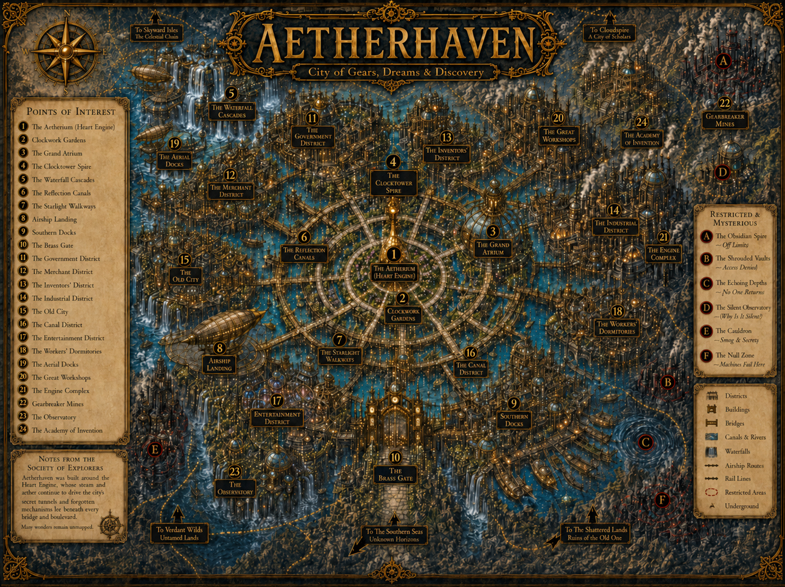

# Location Name

## Map Reference

State the map number or restricted-area letter and link to the full map image.

## Visual Reference

> **Location image pending:** Add at least one canonical image from `art/` when available. Never substitute material from `unused/`.

## Public Map Reference

Use the voice defined in [Map Location Reference Style Guide](Map_Location_Reference_Style_Guide.md).

## Canonical Summary

## Civic, Social, or Narrative Role

## Points of Interest

## Relationships

Use relative Markdown hyperlinks to existing character, organization, location, artifact, and story-arc files.

## Visual Continuity

## Continuity Notes

## Development Checklist

- [ ] Map position and label confirmed.
- [x] Aetherhaven map linked.
- [ ] Canonical location image linked.
- [ ] Points of interest complete.
- [ ] Governing organizations and recurring characters cross-linked.
- [ ] Relevant artifacts and story arcs cross-linked.
- [ ] Backlinks added from directly related profiles.

## Open Canon Questions
