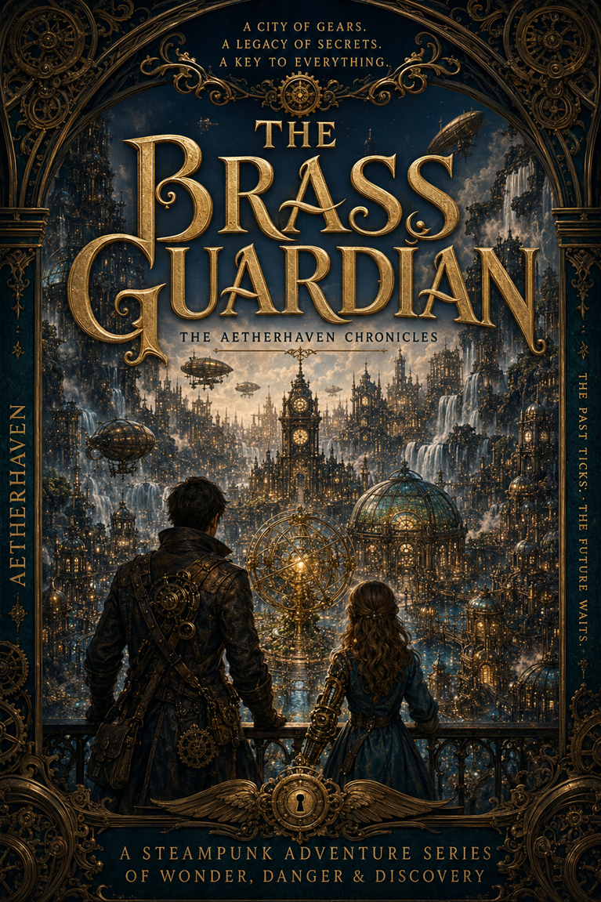

# The Brass Guardian

*The Brass Guardian* is an illustrated steampunk adventure series set in **Aetherhaven**, a city of copper towers, drifting airships, living machinery, shifting gardens, hidden canals, and ancient mechanisms that may remember more than the people who built around them.

At the heart of the series are **Professor Elias Hawthorne** and his daughter **Amelia Hawthorne**. Together, they travel aboard the airship *Wayfinder*, solve strange mechanical mysteries, help people and living machines, and uncover fragments of Aetherhaven's forgotten history.

Amelia carries the **Aether Gauntlet**, a mechanical arm powered by a glowing Aether Heart. Its origins are uncertain, and the oldest systems in Aetherhaven sometimes respond to it in unexpected ways.

## Aetherhaven

Aetherhaven is built around the ancient **Heart Engine**, whose power travels beneath the city through a network known as the Golden Veins.

The city includes:

- the living and ever-changing **Clockwork Gardens**,
- bustling airship ports and workshops,
- elevated walkways and reflection canals,
- engineering guilds and grand civic institutions,
- hidden routes beneath the streets,
- and restricted places the city warns its citizens never to enter.

Time does not always behave properly in Aetherhaven. Clocks lose seconds. Records disagree. Familiar paths move. Airships return with impossible stories. Physical objects and living memories sometimes preserve truths that official history has forgotten.

## Stories for Curious Readers

The series is written to be approachable for readers around age eight and older while remaining engaging for families, preteens, teenagers, and adults reading together.

Each story is designed to stand on its own while contributing to a larger world and continuing mysteries. The adventures emphasize:

- curiosity,
- empathy,
- courage,
- accountability,
- family,
- responsible invention,
- and the belief that understanding something does not grant ownership over it.

## Repository Contents

This repository contains the active working materials for the series:

- the current illustrated manuscript in [PDF](The_Brass_Guardian.pdf) and [Word](The_Brass_Guardian.docx) formats,
- canonical character, organization, location, and story-arc profiles,
- maps, artifact plates, character references, and story artwork,
- and development standards used to preserve continuity across future stories and illustrations.

The Markdown canon files are the primary development source. The compiled manuscript is maintained separately and may not always include the latest world-building changes.

The internal canon profiles contain major spoilers and future-story material. Readers seeking only the stories should begin with the compiled manuscript.

Project development and canon indexing are maintained in [PROJECT_INDEX.md](PROJECT_INDEX.md).

## Project Status

*The Brass Guardian* is an active, evolving creative project. The current work focuses on Aetherhaven while allowing distant regions to appear through travelers, artifacts, airship routes, and stories brought home from beyond the city.

---

> *In Aetherhaven, even the smallest gear may remember where it belongs.*
