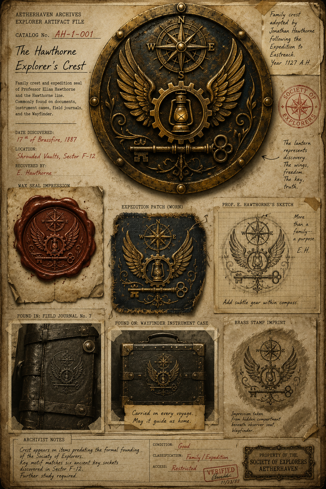

# The Hawthorne Explorer’s Crest

> **Artifact Image Slate #1** · Foundational Canon Images · [Artifact standard](../CANON_MARKDOWN_STANDARD.md)

## Visual Reference

[Open full image](../art/AH-1-001_The_Hawthorne_Explorer's_Crest.png)

## Canonical Purpose

Establishes the Hawthorne family and the crest later found inside the Null Zone. It should include a compass rose, winged gear, lantern, and a subtle key motif.

## Intended Form

Embossed brass seal, wax imprint, stitched expedition patch, and Elias’s handwritten variation.

## Related Canon

- [The Brass Guardian series](../README.md)

## TODO

- [x] Link active canonical art.
- [ ] Confirm archive catalog number, recovery metadata, and publication-safe caption.
- [ ] Add backlinks from every profile that directly references this artifact.
- [ ] Reconcile this slate concept with newer canon before final publication.
