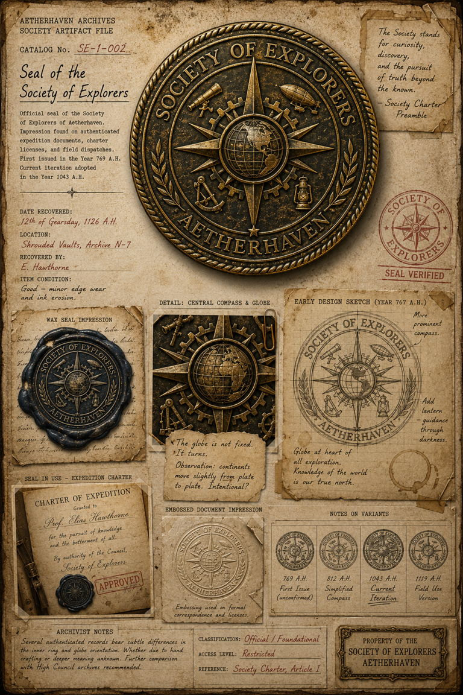
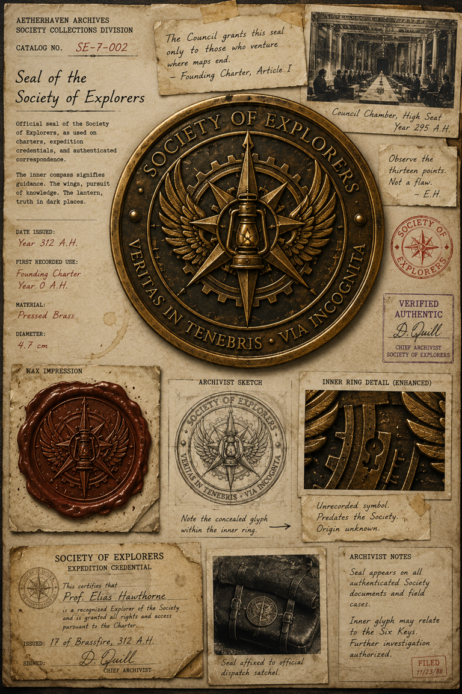

# Seal of the Society of Explorers

> **Artifact Image Slate #2** · Foundational Canon Images · [Artifact standard](../CANON_MARKDOWN_STANDARD.md)

## Visual Reference

[Open full image](../art/SE-1-002_Seal_of_the_Society_of_Explorers.png)

[Open full image](../art/SE-7-002_Seal_of_the_Society_of_Explorers.png)

## Plate Text Transcription — Visual Evidence Only

> This section records text that is physically visible in the active image. Illegible, abraded, redacted, or distorted text is labeled rather than reconstructed. Plate text is preserved even when it conflicts with newer canon.

Two active visual variants are preserved. Their dates, slogans, iconography, and catalog numbers do not fully agree. This transcription records each plate independently without reconciling the differences.

## Variant A — `SE-1-002`

### Archive heading and identification

- **AETHERHAVEN ARCHIVES**
- **SOCIETY ARTIFACT FILE**
- **CATALOG No.** `SE-1-002`
- **Seal of the Society of Explorers**

### Printed description

> Official seal of the Society of Explorers of Aetherhaven. Impression found on authenticated expedition documents, charter licenses, and field dispatches. First issued in the Year 769 A.H. Current iteration adopted in the Year 1043 A.H.

### Recovery information

- **DATE RECOVERED:** `12th of Gearsday, 1126 A.H.`
- **LOCATION:** `Shrouded Vaults, Archive W-7`
- **RECOVERED BY:** `E. Hawthorne`
- **ITEM CONDITION:** `Good — minor edge wear and ink erosion.`

### Charter quotation

> The Society stands for curiosity, discovery, and the pursuit of truth beyond the known.  
> — Society Charter Preamble

### Principal seal text

- Outer upper ring: **SOCIETY OF EXPLORERS**
- Outer lower ring: **AETHERHAVEN**

### Labels and captions

- **WAX SEAL IMPRESSION**
- **DETAIL: CENTRAL COMPASS & GLOBE**
- **EARLY DESIGN SKETCH (YEAR 767 A.H.)**
- **SEAL IN USE — EXPEDITION CHARTER**
- **EMBOSSED DOCUMENT IMPRESSION**
- **NOTES ON VARIANTS**

### Handwritten observations

Beneath the central globe detail:

> The globe is not fixed.  
> It turns.  
> Observation: continents move slightly from plate to plate. Intentional?

On the early design sketch:

> More prominent compass.

> Add lantern — guidance through darkness.

> Globe at heart of all exploration.  
> Knowledge of the world is our true north.

Beneath the embossed impression:

> Embossing used on formal correspondence and licenses.

### Expedition charter text

> **CHARTER OF EXPEDITION**  
> Granted to  
> **Prof. Elias Hawthorne**  
> for the pursuit of knowledge  
> and the betterment of all.  
> By authority of [the Council](../organizations/The_High_Council_of_Aetherhaven.md),
> **Society of Explorers.**

A red stamp across the charter reads **APPROVED**.

### Variant chronology

- `769 A.H.` — **First Issue (unconfirmed)**
- `812 A.H.` — **Simplified Compass**
- `1043 A.H.` — **Current Iteration**
- `1119 A.H.` — **Field Use Version**

### Archivist notes

> Several authenticated records bear subtle differences in the inner ring and globe orientation. Whether due to hand crafting or deeper meaning unknown. Further comparison with [High Council](../organizations/The_High_Council_of_Aetherhaven.md) archives recommended.

### Classification and control fields

- **CLASSIFICATION:** `Official / Foundational`
- **ACCESS LEVEL:** `Restricted`
- **REFERENCE:** `Society Charter, Article I`

### Variant A seals and property marks

- Red circular **SOCIETY OF EXPLORERS** verification stamp surrounding a compass emblem.
- Red text beneath the stamp: **SEAL VERIFIED**.
- Bottom-right brass plaque:

> **PROPERTY OF THE**  
> **SOCIETY OF EXPLORERS**  
> **AETHERHAVEN**

---

## Variant B — `SE-7-002`

### Archive heading and identification

- **AETHERHAVEN ARCHIVES**
- **SOCIETY COLLECTIONS DIVISION**
- **CATALOG NO.** `SE-7-002`
- **Seal of the Society of Explorers**

### Printed description

> Official seal of the Society of Explorers, as used on charters, expedition credentials, and authenticated correspondence.

> The inner compass signifies guidance. The wings, pursuit of knowledge. The lantern, truth in dark places.

### Issue and physical information

- **DATE ISSUED:** `Year 312 A.H.`
- **FIRST RECORDED USE:** `Founding Charter — Year 0 A.H.`
- **MATERIAL:** `Pressed Brass`
- **DIAMETER:** `4.7 cm`

### Founding Charter quotation

> [The Council](../organizations/The_High_Council_of_Aetherhaven.md) grants this seal only to those who venture where maps end.
> — Founding Charter, Article I

### Historical photograph caption

> Council Chamber, High Seat  
> Year 295 A.H.

### Hawthorne annotation

> Observe the thirteen points.  
> Not a flaw.  
> — E.H.

### Principal seal text

- Upper ring: **SOCIETY OF EXPLORERS**
- Lower ring: **VERITAS IN TENEBRIS • VIA INCOGNITA**

### Authentication block

- **VERIFIED AUTHENTIC**
- Signature: `L. Quill`
- Title: **CHIEF ARCHIVIST**
- Organization: **SOCIETY OF EXPLORERS**

### Labels and captions

- **WAX IMPRESSION**
- **ARCHIVIST SKETCH**
- **INNER RING DETAIL (ENHANCED)**
- **SOCIETY OF EXPLORERS — EXPEDITION CREDENTIAL**

### Hidden-glyph annotations

Beneath the archivist sketch:

> Note the concealed glyph within the inner ring.

Beneath the enhanced detail:

> Unrecorded symbol.  
> Predates the Society.  
> Origin unknown.

### Expedition credential text

> **SOCIETY OF EXPLORERS**  
> **EXPEDITION CREDENTIAL**

> This certifies that  
> **Prof. Elias Hawthorne**  
> is a recognized Explorer of the Society  
> and is granted all rights and access  
> pursuant to the Charter.

- **ISSUED:** `17 of Brassfire, 312 A.H.`
- **SIGNED:** `L. Quill`
- **CHIEF ARCHIVIST**

### Dispatch-satchel photograph caption

> Seal affixed to official dispatch satchel.

### Archivist notes

> Seal appears on all authenticated Society documents and field cases.

> Inner glyph may relate to the Six Keys.  
> Further investigation authorized.

- Red filing stamp: **FILED**
- Date: `11/23/88`

## Complete Plate Description — Visual Evidence Only

### Variant A visual description

Variant A is a dense parchment dossier built around a large circular bronze seal. The principal seal is dark, weathered, and surrounded by a rope-pattern border. Its central composition contains a gridded globe placed over a compass rose and toothed gear. A telescope appears at upper left, a small airship at upper right, a sextant at lower left, and a lantern at lower right. Laurel branches curve along the lower sides.

The plate includes a dark blue-black wax impression, a close-up of the central globe, an early pencil design, a charter bearing a small attached seal, a pale embossed paper impression, and four miniature chronological variants. The globe in the central detail visibly includes continental forms and appears mounted to rotate.

The paper is stained, torn, taped, and ring-marked. No redactions are visible. The seal and the Society property plaque repeat the compass-star symbol.

### Variant B visual description

Variant B uses a different seal design and a different archival layout. The principal pressed-brass medallion shows a lantern centered over a many-pointed compass star, backed by wings and a gear. The lower Latin motto occupies the outer ring. Small fasteners or rivets punctuate the ring.

Supporting evidence includes a red-brown wax impression, an archivist’s construction sketch, a magnified close-up of the inner gear ring, an expedition credential, and a sepia photograph of a leather dispatch satchel bearing the seal. The close-up identifies a small keyhole-like glyph cut into the inner ring.

The top-right historical photograph depicts a formal council chamber with a long table and seated officials. Variant B also carries a red circular Society stamp and a boxed authentication signature from L. Quill.

### Differences visible between the variants

- Variant A uses catalog number `SE-1-002`; Variant B uses `SE-7-002`.
- Variant A centers a globe; Variant B centers a lantern and winged compass.
- Variant A states first issue `769 A.H.`; Variant B states date issued `312 A.H.` and first recorded use `Year 0 A.H.`.
- Variant A’s ring reads **AETHERHAVEN**; Variant B’s ring uses the Latin motto **VERITAS IN TENEBRIS • VIA INCOGNITA**.
- Variant B explicitly documents thirteen compass points and a concealed inner glyph.

These differences are visually preserved and are not corrected within the artifact record.

## Non-Visual Canon References and Story Context

The two active images are provisional seal variants. Neither is automatically the sole final design until the project owner selects a canonical seal or assigns distinct historical/functional uses to both.

The hidden inner glyph in Variant B may connect to [The Six-Key Sigil](003_The_Six_Key_Sigil.md) or [The First Mechanist’s Mark](004_The_First_Mechanists_Mark.md), but that relationship is not established solely by the image.

The Society of Explorers does not yet have its own organization profile. Until one is created, institutional information should remain concise here and in linked files such as the [Aerial Mariners’ Union](../organizations/The_Aerial_Mariners_Union.md).

## Related Canon

- [Aerial Mariners' Union](../organizations/The_Aerial_Mariners_Union.md)

## Continuity Notes

- This file is authoritative for the visible content and physical presentation of the active artifact image or images.
- Linked character, organization, location, and story-arc files remain authoritative for broader history and plot context.
- Visible plate claims are not silently corrected when they conflict with later canon; discrepancies are documented explicitly.
- Material from `unused/` is excluded and was not consulted.

## TODO / Production Checklist

- [x] Active canonical art linked.
- [x] All clearly readable plate text transcribed.
- [x] Dates, signatures, seals, stamps, redactions, names, places, and identifying marks documented.
- [x] Complete visual-only plate description added.
- [x] Non-visual canon and story context separated from visual evidence.
- [ ] Add backlinks from every active profile that directly references this artifact.
- [ ] Resolve documented plate/canon discrepancies only through an explicit canon decision.
- [ ] Approve a publication-safe caption.
