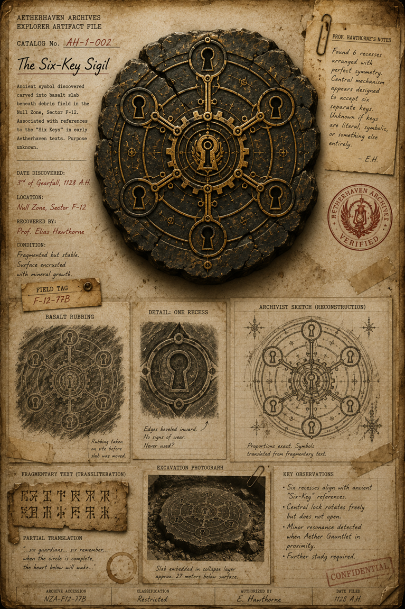

# The Six-Key Sigil

> **Artifact Image Slate #3** · Foundational Canon Images · [Artifact standard](../docs/standards/CANON_MARKDOWN_STANDARD.md)

## Visual Reference

[Open full image](../art/AH-1-002_The_Six-Key_Sigil.png)

## Plate Text Transcription — Visual Evidence Only

> This section records text that is physically visible in the active image. Illegible, abraded, redacted, or distorted text is labeled rather than reconstructed. Plate text is preserved even when it conflicts with newer canon.

### Archive heading and identification

- **AETHERHAVEN ARCHIVES**
- **EXPLORER ARTIFACT FILE**
- **CATALOG No.** `AH-1-002`
- **The Six-Key Sigil**

### Printed description

> Ancient symbol discovered carved into basalt slab beneath debris field in the Null Zone, Sector F-12. Associated with references to the “Six Keys” in early Aetherhaven texts. Purpose unknown.

### Recovery and condition information

- **DATE DISCOVERED:** `3rd of Gearfall, 1128 A.H.`
- **LOCATION:** `Null Zone, Sector F-12`
- **RECOVERED BY:** `Prof. Elias Hawthorne`
- **CONDITION:** `Fragmented but stable. Surface encrusted with mineral growth.`
- **FIELD TAG:** `F-12-77B`

### Professor Hawthorne’s notes

> Found 6 recesses arranged with perfect symmetry. Central mechanism appears designed to accept six separate keys. Unknown if keys are literal, symbolic, or something else entirely.  
> — E.H.

### Labels and captions

- **BASALT RUBBING**
- **DETAIL: ONE RECESS**
- **ARCHIVIST SKETCH (RECONSTRUCTION)**
- **FRAGMENTARY TEXT (TRANSLITERATION)**
- **PARTIAL TRANSLATION**
- **EXCAVATION PHOTOGRAPH**
- **KEY OBSERVATIONS**

### Rubbing and recess annotations

Beneath the basalt rubbing:

> Rubbing taken on site before slab was moved.

Beside the enlarged recess:

> Edges beveled inward.  
> No signs of wear.  
> Never used?

Beside the reconstruction:

> Proportions exact. Symbols translated from fragmentary text.

### Fragmentary inscription

The image includes two lines of non-Latin angular glyphs. They are shown as a transliteration sample but do not form reliably readable English characters.

### Partial translation

> “…six guardians… six remember…  
> when the circle is complete,  
> the heart below will wake…”

### Excavation photograph caption

> Slab embedded in collapse layer approx. 27 meters below surface.

### Key observations

- Six recesses align with ancient “Six-Key” references.
- Central lock rotates freely but does not open.
- Minor resonance detected when Aether Gauntlet in proximity.
- Further study required.

### Archive control fields

- Red circular stamp: **AETHERHAVEN ARCHIVES — VERIFIED**
- Red diagonal stamp: **CONFIDENTIAL**
- **ARCHIVE ACCESSION:** `NZA-F12-77B`
- **CLASSIFICATION:** `Restricted`
- **AUTHORIZED BY:** `E. Hawthorne`
- **DATE FILED:** the plate appears to read `1/28 A.H.`; the field is visually incomplete or abbreviated and should not be silently expanded.

## Complete Plate Description — Visual Evidence Only

The principal object is a fractured circular basalt slab shown against aged archival parchment. Six large keyhole-shaped recesses are evenly spaced around a complex central lock. Each outer recess is mounted in a round brass or carved-stone frame connected to the center by a radial arm. The central assembly resembles a keyhole embedded in concentric gears and circular tracks.

The dark stone surface is heavily cracked and mottled with ochre mineral deposits. Fine rings, alignment marks, and small repeated glyphs cover the spaces between the keyholes. The overall construction is mechanically precise despite the slab’s broken perimeter.

The lower half of the plate presents five evidence forms:

1. a charcoal rubbing of the complete sigil;
2. a close rubbing of one keyhole recess;
3. a measured reconstruction on grid paper;
4. a fragment of angular inscription with a partial translation;
5. a sepia excavation photograph showing the slab lying amid rubble.

A field tag is pinned beside the recovery data. The verified stamp uses a lantern framed by laurel or wings. The page has folded corners, tape, paper clips, stains, and a red confidentiality stamp. No black redactions are visible.

## Non-Visual Canon References and Story Context

This artifact is the authoritative visual record for the Six-Key arrangement. The [Eight Founding Engineering Guilds](../organizations/The_Eight_Founding_Engineering_Guilds.md) are a later human civic order and should not be conflated with the older sixfold system.

The plate’s claim that the Aether Gauntlet produces resonance is visual evidence from this plate. The broader meaning of that resonance belongs to the surrounding story canon and [The Thirteenth Chair](../story_arcs/The_Thirteenth_Chair.md).

The quoted partial translation and all dates remain plate evidence. They should be referenced as archival claims rather than omniscient proof unless corroborated elsewhere.

## Related Canon

- [The Thirteenth Chair](../story_arcs/The_Thirteenth_Chair.md)
- [Eight Founding Engineering Guilds](../organizations/The_Eight_Founding_Engineering_Guilds.md)

## Continuity Notes

- This file is authoritative for the visible content and physical presentation of the active artifact image or images.
- Linked character, organization, location, and story-arc files remain authoritative for broader history and plot context.
- Visible plate claims are not silently corrected when they conflict with later canon; discrepancies are documented explicitly.
- Material from `unused/` is excluded and was not consulted.

## TODO / Production Checklist

- [x] Active canonical art linked.
- [x] All clearly readable plate text transcribed.
- [x] Dates, signatures, seals, stamps, redactions, names, places, and identifying marks documented.
- [x] Complete visual-only plate description added.
- [x] Non-visual canon and story context separated from visual evidence.
- [ ] Add backlinks from every active profile that directly references this artifact.
- [ ] Resolve documented plate/canon discrepancies only through an explicit canon decision.
- [ ] Approve a publication-safe caption.
