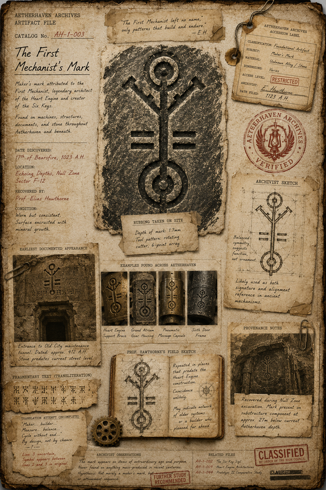

# [The First Mechanist](../characters/The_First_Mechanist.md)’s Mark

> **Artifact Image Slate #4** · Foundational Canon Images · [Artifact standard](../CANON_MARKDOWN_STANDARD.md)

## Visual Reference

[Open full image](../art/AH-1-003_The_First_Mechanist's_Mark.png)

## Plate Text Transcription — Visual Evidence Only

> This section records text that is physically visible in the active image. Illegible, abraded, redacted, or distorted text is labeled rather than reconstructed. Plate text is preserved even when it conflicts with newer canon.

### Archive heading and identification

- **AETHERHAVEN ARCHIVES**
- **ARTIFACT FILE**
- **CATALOG No.** `AH-1-003`
- **The First Mechanist’s Mark**

### Printed description

> Maker’s mark attributed to the First Mechanist, legendary architect of the Heart Engine and creator of the Six Keys.

> Found on machines, structures, documents, and stone throughout Aetherhaven and beneath.

### Recovery and condition information

- **DATE DISCOVERED:** `17th of Bearsfires, 1023 A.H.`
- **LOCATION:** `Echoing Depths, Null Zone — Sector F-12`
- **RECOVERED BY:** `Prof. Elias Hawthorne`
- **CONDITION:** `Worn but consistent. Surface encrusted with mineral growth.`

### Top quotation

> The First Mechanist left no name, only patterns that build and endure.  
> — E.H.

### Hanging accession label

- **AETHERHAVEN ARCHIVES — ACCESSION LABEL**
- **CLASSIFICATION:** `Foundational Artifact`
- **SUBJECT:** `Maker’s Mark`
- **MATERIAL:** `Unknown Alloy / Stone`
- **DIMENSIONS:** `Varies`
- **ACCESS LEVEL:** `RESTRICTED`
- **ARCHIVIST:** `E. Hawthorne`
- **DATE FILED:** `1123 A.H.`

### Rubbing note

- **RUBBING TAKEN ON SITE**

> Depth of mark: 1.7 mm  
> Tool pattern: rotating cutter, 6-point array

### Archivist sketch annotations

- **ARCHIVIST SKETCH**

> Balanced symmetry suggests function, not ornament.

> Likely used as both signature and alignment reference in ancient mechanisms.

### Earliest documented appearance

- **EARLIEST DOCUMENTED APPEARANCE**

> Entrance to Old City maintenance tunnel. Dated: approx. 412 A.H. Stone predates current street level.

### Examples found across Aetherhaven

- **Heart Engine Support Brace**
- **Grand Atrium Gear Housing**
- **Pneumatic Message Capsule**
- **Sixth Door Frame**

### Fragmentary text and translation attempt

- **FRAGMENTARY TEXT (TRANSLITERATION):** two lines of angular non-Latin glyphs.
- **TRANSLATION ATTEMPT (INCOMPLETE):**

> “Maker… builder…  
> Measure… balance…  
> Cycle without end…  
> By design, not by chance.”

Red annotation:

> Line 3 uncertain.  
> Symbol appears between lines 2 and 3 in original.

### Professor Hawthorne’s field sketch

- **PROF. HAWTHORNE’S FIELD SKETCH**

> Repeated in places that predate the Heart Engine construction.  
> Coincidence unlikely.

> May indicate network of older systems… or a builder who planned far ahead.

### Provenance notes

- **PROVENANCE NOTES**

> Recovered during Null Zone excavation. Mark present on substructure component at approx. 27m below current Aetherhaven depth.

### Archivist observations

> The mark appears on items of extraordinary age and purpose.  
> Never found on anything mass-produced in recent centuries.  
> Hypothesis: Not merely a maker’s mark, but a function or attachment sequence.

Red stamp: **FURTHER STUDY RECOMMENDED**

### Related files listed on the plate

- `AH-1-002` — **The Six-Key Sigil**
- `AH-1-009` — **Heart Engine Architecture**
- `AH-1-014` — **Prototype II Comparative Study**

### Security marks

- Red circular stamp: **AETHERHAVEN ARCHIVES — VERIFIED**
- Large red stamp: **CLASSIFIED — BY ORDER OF THE HIGH COUNCIL**
- A smaller black classification/control mark at the lower-right edge is partially obscured and not fully legible.

## Complete Plate Description — Visual Evidence Only

The central evidence is a large charcoal or graphite rubbing of a deeply incised symbol on rough dark stone. The mark is vertically symmetrical. It consists of:

- a ring or circular eye at the top;
- a straight vertical shaft;
- two diagonal branches rising outward beneath the upper ring;
- paired horizontal bars on both sides of the shaft;
- a large lower ring with a central point or socket;
- short alignment projections along the main axis.

The symbol resembles both a maker’s monogram and a mechanical alignment diagram. Its surfaces appear cut by a rotating multi-point tool rather than scratched by hand.

The page presents the mark through multiple forms: the principal rubbing, a measured archivist sketch, a field-journal sketch, an old stone inscription, four photographs showing the mark on different mechanisms, a carved example in a subterranean wall, and two lines of angular inscription.

The evidence is arranged on stained, folded parchment with paper clips, tags, a brass gear used as a paperweight, tape repairs, and red archival stamps. The hanging accession tag is tied through two brass eyelets. The page visibly distinguishes verified evidence, hypotheses, and incomplete translation. No text is black-redacted, but a lower classification mark is partly obscured by overlapping stamps.

## Non-Visual Canon References and Story Context

The plate attributes the mark to [the First Mechanist](../characters/The_First_Mechanist.md), but the identity, office, and historical chronology of [the First Mechanist](../characters/The_First_Mechanist.md) remain unresolved in [The Thirteenth Chair](../story_arcs/The_Thirteenth_Chair.md) and the [High Council of Aetherhaven](../organizations/The_High_Council_of_Aetherhaven.md).

The plate’s related-file label “Prototype II Comparative Study” conflicts with the active use of catalog number `AH-1-014` for [The Missing Prototype I Catalog Card](012_The_Missing_Prototype_I_Catalog_Card.md). The inconsistency is preserved as plate evidence and must not be silently corrected.

The mark may be a signature, command symbol, alignment instruction, office seal, or functional attachment sequence. The image itself does not resolve which interpretation is correct.

## Related Canon

- [High Council of Aetherhaven](../organizations/The_High_Council_of_Aetherhaven.md)
- [The Thirteenth Chair](../story_arcs/The_Thirteenth_Chair.md)
- [Chancellor Octavia Vale](../characters/Chancellor_Octavia_Vale.md)

## Continuity Notes

- This file is authoritative for the visible content and physical presentation of the active artifact image or images.
- Linked character, organization, location, and story-arc files remain authoritative for broader history and plot context.
- Visible plate claims are not silently corrected when they conflict with later canon; discrepancies are documented explicitly.
- Material from `unused/` is excluded and was not consulted.

## TODO / Production Checklist

- [x] Active canonical art linked.
- [x] All clearly readable plate text transcribed.
- [x] Dates, signatures, seals, stamps, redactions, names, places, and identifying marks documented.
- [x] Complete visual-only plate description added.
- [x] Non-visual canon and story context separated from visual evidence.
- [ ] Add backlinks from every active profile that directly references this artifact.
- [ ] Resolve documented plate/canon discrepancies only through an explicit canon decision.
- [ ] Approve a publication-safe caption.
