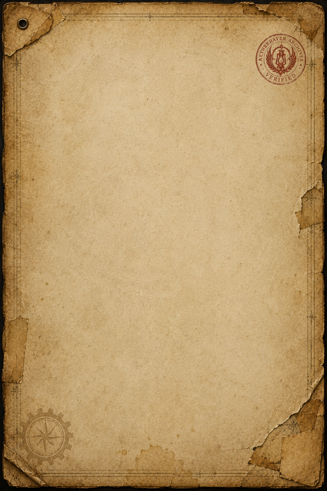

# Canonical Aetherhaven Archive Label

> **Artifact Image Slate #6** · Foundational Canon Images · [Artifact standard](../CANON_MARKDOWN_STANDARD.md)

## Visual Reference

[Open full image](../art/AH-X-YYY.png)

## Plate Text Transcription — Visual Evidence Only

> **Not yet authoritative.** The linked asset is classified as a working placeholder rather than a completed artifact plate. Its incidental text, if any, must not be treated as canon or as the final archive-label standard. A full transcription will be created when a final canonical blank label or completed example plate is selected.

## Complete Plate Description — Visual Evidence Only

> **Pending final asset selection.** This file intentionally does not infer a permanent archive format from the placeholder image.

## Non-Visual Canon References and Story Context

This artifact concept provides the recurring graphic framework for [Aetherhaven](../locations/Aetherhaven.md) archival pages: accession number, source, recovery location, condition, classification, stamps, and handling status. The final visual standard has not yet been approved.

## Related Canon

- [Project Index](../PROJECT_INDEX.md)
- [Canon Markdown and Visual Integration Standard](../CANON_MARKDOWN_STANDARD.md)

## Continuity Notes

- The linked file is a placeholder, not an authoritative completed plate.
- Do not derive archive bureaucracy, dating systems, seals, or catalog rules from incidental placeholder details.
- Material from `unused/` is excluded and was not consulted.

## TODO / Production Checklist

- [x] Working placeholder linked.
- [ ] Select or generate the final canonical archive-label framework.
- [ ] Transcribe all visible text after the final asset is approved.
- [ ] Document final fields, seals, stamps, and classification conventions.
- [ ] Add the final format to every future artifact plate template.
