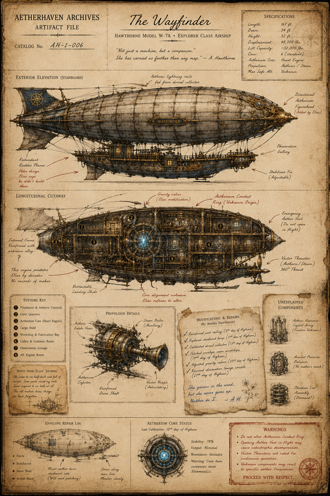

# The Wayfinder Technical Plate

> **Artifact Image Slate #7** · Foundational Canon Images · [Artifact standard](../docs/standards/CANON_MARKDOWN_STANDARD.md)

## Visual Reference

[Open full image](../art/AH-1-006_The_Wayfinder.png)

## Plate Text Transcription — Visual Evidence Only

> This section records text that is physically visible in the active image. Illegible, abraded, redacted, or distorted text is labeled rather than reconstructed. Plate text is preserved even when it conflicts with newer canon.

### Archive heading and vessel identification

- **AETHERHAVEN ARCHIVES**
- **ARTIFACT FILE**
- **CATALOG No.** `AH-1-006`
- **The Wayfinder**
- **HAWTHORNE MODEL W-7A • EXPLORER CLASS AIRSHIP**

### Quotation

> “Not just a machine, but a companion.”  
> “She has carried us farther than any map.”  
> — A. Hawthorne

### Specifications

- **Length:** `167 ft.`
- **Beam:** `34 ft.`
- **Height:** `52 ft.`
- **Displacement:** `48,700 lbs.`
- **Lift Capacity:** `~32,000 lbs.`
- **Crew:** `6 (standard)`
- **Aetherium Core:** `Heart Engine`
- **Propulsion:** `Aetheric / Steam`
- **Max Safe Alt.:** `Unknown`

### Exterior elevation labels

- **EXTERIOR ELEVATION (STARBOARD)**
- **Aetheric lightning rails — fed from dorsal collector**
- **Directional Aetherium Figurehead (Added by Elias)**
- **Observation Gallery**
- **Stabilizer Fin (Adjustable)**
- **Redundant Rudder Planes**

Handwritten note beside the rudder planes:

> Older design.  
> Elias says he didn’t build these.

### Longitudinal cutaway labels and notes

- **LONGITUDINAL CUTAWAY**
- **Internal Frame Reinforced with unknown alloy.**
- A handwritten question mark appears beside the unknown-alloy note.
- **This engine predates Elias by decades. No records of maker.**
- **Retractable Landing Skids**
- **Gravity valves (Elias modification)**
- **Aetherium Conduit Ring (Unknown Origin)**
- **Emergency Aether Vent (Do not open in flight)**
- **Vector Thruster (Aetheric/Steam 360° Thrust)**
- Red note beneath the core: **Core alignment unknown. Elias refuses to alter.**

### Systems key

1. **Pilothouse & Aetheric Controls**
2. **Crew Quarters**
3. **Aetherium Core (Heart Engine)**
4. **Cargo Hold**
5. **Workshop & Fabrication Bay**
6. **Galley & Common Room**
7. **Observation Lounge**
8. **Aft Engine Room**

### Notes from Elias’ journal

> She came to me half-built and full of secrets. Some parts resist my tools. Some respond to no tools at all. The old makers knew things we have forgotten.

### Propulsion-detail labels

- **PROPULSION DETAILS**
- **Aetheric Intake Vanes**
- **Aetherium Injector**
- **Reinforced Drive Shaft**
- **Steam Boiler (Auxiliary)**
- **Vector Nozzle (Articulating)**

### Modifications and repairs

- **MODIFICATIONS & REPAIRS (By Amelia Hawthorne)**
- `✓` Reinforced port railing (`5th day of Highsun`)
- `✓` Replaced starboard lamp (`11th day of Highsun`)
- `✓` Calibrated dorsal collector (`13th day of Highsun`)
- `✓` Patched envelope seam amidships (`19th day of Highsun`)
- `✓` Adjusted gravity valves (`23rd day of Highsun`)
- `✓` Rewired observation lounge console (`27th day of Highsun`)

Blue handwritten note:

> She groans in the wind,  
> but she never gives up.  
> Neither do I. — A.H.

### Unexplained components

- **UNEXPLAINED COMPONENTS**
- **Aetheric Resonance Crystal Array (Function Unknown)**
- **Ancient Pressure Balance (No maker’s mark)**
- **Obsidian Coil Assembly (Dormant)**

### Envelope repair log

- **ENVELOPE REPAIR LOG**
- Legend: **Patch**, **Reinforced**, **Seam Wear**, **Aether-Burn**
- Note: **Minor aether-burn starboard side. (Will need patching.)**
- Note: **Stress along seam line. Monitor closely.**

### Aetherium core status

- **AETHERIUM CORE STATUS**
- **Last Calibration:** `12th day of Highsun`
- **Stability:** `78%`
- **Output:** `Nominal`
- **Resonance:** `Variable`
- **Warning:** `Core hum increases near Stormwalls.`

### Warnings

- **Do not alter Aetherium Conduit Ring.**
- **Opening Aether Vent in flight may cause catastrophic decompression.**
- **Vector Thrusters not rated for continuous operation.**
- **Unknown components may react to specific aether frequencies.**
- **PROCEED WITH RESPECT.**

## Complete Plate Description — Visual Evidence Only

The plate is a full technical dossier showing the *Wayfinder* through elevation, cutaway, component study, repair map, and core-status diagram.

The upper exterior elevation depicts a long silver-gray rigid airship envelope reinforced by longitudinal ribs and dark seam lines. The name **WAYFINDER** appears on a small central plaque. A compass emblem is painted on the tail fin. The gondola is an elaborate multi-deck brass-and-steel vessel suspended beneath the envelope, with windows, railings, pipes, observation spaces, and an aft thruster.

The central longitudinal cutaway reveals a densely packed interior arranged around a bright blue Aetherium core. Numbered circles correspond to the systems key. The cutaway shows rooms, corridors, machinery, storage, framing, landing skids, and a rear vector thruster. Red annotations distinguish modifications by Elias from components of unknown origin.

The propulsion study shows a separate engine assembly with intake vanes, injector, reinforced shaft, auxiliary steam boiler, and articulating nozzle. Amelia’s repair sheet is graph paper taped over the dossier and includes blue handwriting and a small flower sketch. Three unexplained components are drawn separately at right as vertically stacked technical miniatures.

The lower repair log maps patches, reinforcement, seam wear, and aether-burn marks across a small envelope diagram. The core-status panel shows the blue core in a circular brass housing. A red-bordered warning box and red compass stamp close the plate.

The sheet is aged, folded, stained, taped, and patched. It contains no black redactions. Different handwriting colors and styles distinguish printed archive labels, Elias’s darker notes, Amelia’s blue notes, and red danger annotations.

## Non-Visual Canon References and Story Context

The technical plate is the authoritative visual record for the *Wayfinder* as currently depicted, but individual dimensions, dates, and component names remain plate claims until reinforced by broader canon.

The *Wayfinder* is tied to the [Gardens Airship Landing](../locations/The_Gardens_Airship_Landing.md), the [Aerial Mariners’ Union](../organizations/The_Aerial_Mariners_Union.md), [Captain Mara Voss](../characters/Captain_Mara_Voss.md), and [Pip](../characters/Pip.md).

The plate establishes that some systems predate [Elias Hawthorne](../characters/Professor_Elias_Hawthorne.md)’s work and that [Elias](../characters/Professor_Elias_Hawthorne.md) refuses to alter the unknown core alignment. The origin and function of the older components remain intentionally unresolved. [Amelia](../characters/Amelia_Hawthorne.md)’s maintenance notes are visual character evidence but do not replace her eventual full profile.

## Related Canon

- [Gardens Airship Landing](../locations/The_Gardens_Airship_Landing.md)
- [Aerial Mariners' Union](../organizations/The_Aerial_Mariners_Union.md)
- [Pip](../characters/Pip.md)
- [Captain Mara Voss](../characters/Captain_Mara_Voss.md)

## Continuity Notes

- This file is authoritative for the visible content and physical presentation of the active artifact image or images.
- Linked character, organization, location, and story-arc files remain authoritative for broader history and plot context.
- Visible plate claims are not silently corrected when they conflict with later canon; discrepancies are documented explicitly.
- Material from `unused/` is excluded and was not consulted.

## TODO / Production Checklist

- [x] Active canonical art linked.
- [x] All clearly readable plate text transcribed.
- [x] Dates, signatures, seals, stamps, redactions, names, places, and identifying marks documented.
- [x] Complete visual-only plate description added.
- [x] Non-visual canon and story context separated from visual evidence.
- [ ] Add backlinks from every active profile that directly references this artifact.
- [ ] Resolve documented plate/canon discrepancies only through an explicit canon decision.
- [ ] Approve a publication-safe caption.
