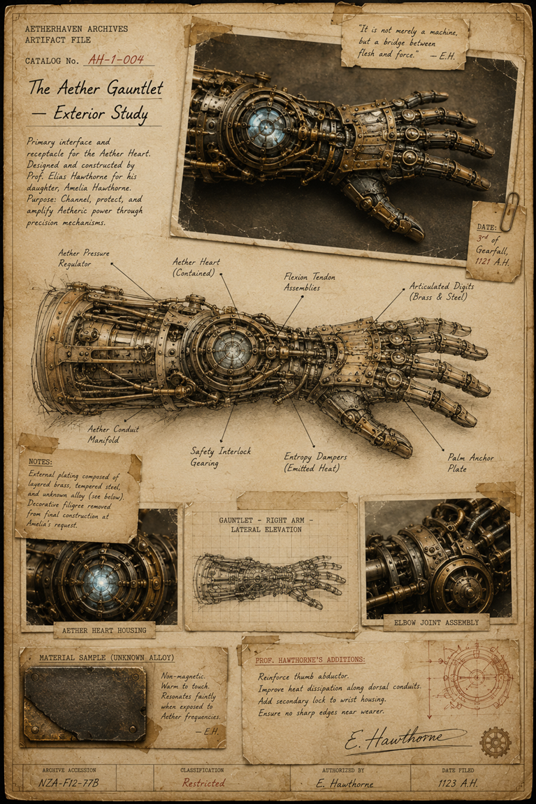

# The Aether Gauntlet: Exterior Study

> **Artifact Image Slate #9** · Amelia and the Aether Gauntlet · [Artifact standard](../CANON_MARKDOWN_STANDARD.md)

## Visual Reference

[Open full image](../art/AH-1-004_The_Aether_Gauntlet-Exterior_Study.png)

## Canonical Purpose

Shows gears, pistons, plates, pipes, pressure chambers, articulated fingers, and the embedded Aether Heart. Some components should be labeled “origin unknown.”

## Intended Form

Detailed Academy lithograph with brass measurement tools and handwritten corrections.

## Related Canon

- [The Black Catalogue Arc](../story_arcs/The_Black_Catalogue_Arc.md)
- [The Keeper of Dreams](../story_arcs/The_Keeper_of_Dreams.md)

## TODO

- [x] Link active canonical art.
- [ ] Confirm archive catalog number, recovery metadata, and publication-safe caption.
- [ ] Add backlinks from every profile that directly references this artifact.
- [ ] Reconcile this slate concept with newer canon before final publication.
