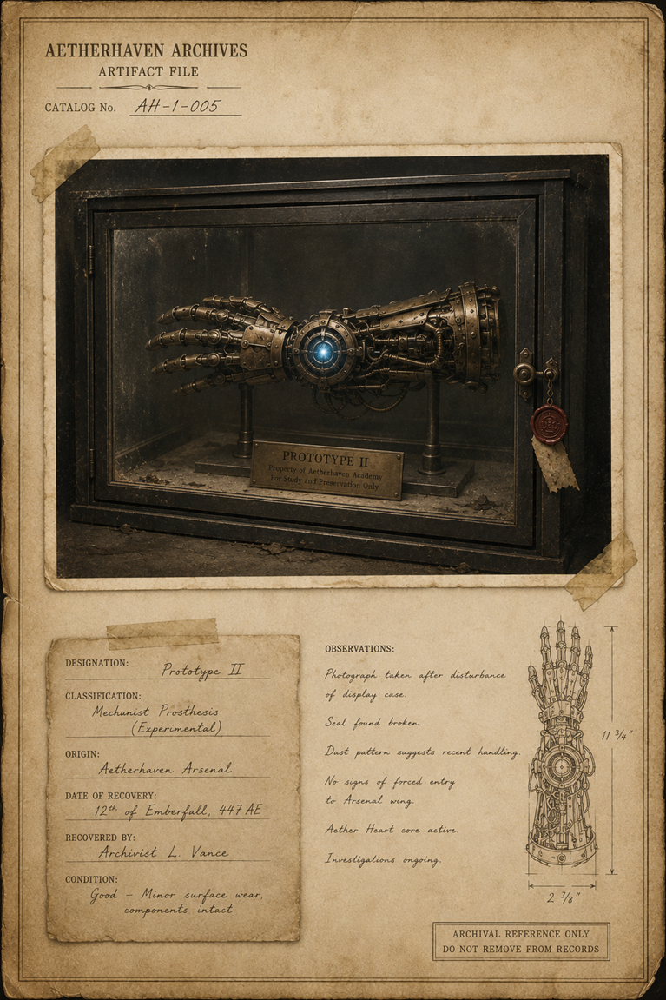

# Prototype II Cabinet Photograph

> **Artifact Image Slate #11** · Amelia and the Aether Gauntlet · [Artifact standard](../CANON_MARKDOWN_STANDARD.md)

## Visual Reference

[Open full image](../art/AH-1-005_Prototype_II.png)

## Plate Text Transcription — Visual Evidence Only

> This section records text that is physically visible in the active image. Illegible, abraded, redacted, or distorted text is labeled rather than reconstructed. Plate text is preserved even when it conflicts with newer canon.

### Archive heading and identification

- **AETHERHAVEN ARCHIVES**
- **ARTIFACT FILE**
- **CATALOG No.** `AH-1-005`

### Cabinet label

> **PROTOTYPE II**  
> Property of Aetherhaven Academy  
> For Study and Preservation Only

### Catalog data card

- **DESIGNATION:** `Prototype II`
- **CLASSIFICATION:** `Mechanist Prosthesis (Experimental)`
- **ORIGIN:** `Aetherhaven Arsenal`
- **DATE OF RECOVERY:** `12th of Emberfall, 447 AE`
- **RECOVERED BY:** `Archivist L. Vance`
- **CONDITION:** `Good — Minor surface wear, components intact`

### Observations

- Photograph taken after disturbance of display case.
- Seal found broken.
- Dust pattern suggests recent handling.
- No signs of forced entry to Arsenal wing.
- Aether Heart core active.
- Investigation ongoing.

### Measurement labels

- Vertical dimension: `11 3/4"`
- Horizontal dimension: `2 7/8"`

### Control notice

> **ARCHIVAL REFERENCE ONLY**  
> **DO NOT REMOVE FROM RECORDS**

### Seal and tag

A small red-brown wax seal hangs from the cabinet latch on a cord. Its central emblem is visible but its surrounding text is too small to transcribe reliably.

## Complete Plate Description — Visual Evidence Only

The plate is unusually restrained compared with the other artifact dossiers. A single large archival photograph dominates the upper two-thirds of the parchment.

The photograph shows a mechanical forearm and hand displayed horizontally inside a black glass-fronted cabinet. The prosthesis rests on two narrow metal supports. It has articulated brass fingers, dense wrist gearing, dark conduit tubes, and a blue luminous circular core at the wrist. The cabinet’s interior is dusty and scratched. Small debris is visible along the base.

A brass plaque mounted inside the case identifies the object as **PROTOTYPE II**. The cabinet door has a circular latch at right, beside which hangs a wax seal and torn paper tag. The seal appears broken or disturbed, matching the written observation.

Below the photograph, a taped catalog card records designation, classification, origin, recovery, and condition. A second text block records the disturbance investigation. A narrow line drawing at right shows the prosthesis vertically with measurement arrows.

The parchment has a formal border, clipped or torn corners, age stains, and tape securing the photograph and data card. There are no black redactions.

## Non-Visual Canon References and Story Context

The active plate visually documents Prototype II and its disturbed display case. The broader history of the prototype, its relationship to Amelia’s gauntlet, and the meaning of its active core belong to [The Black Catalogue Arc](../story_arcs/The_Black_Catalogue_Arc.md), [The Ninth Guild](../organizations/The_Ninth_Guild.md), and [The Order of the Closed Eye](../organizations/The_Order_of_the_Closed_Eye.md).

The plate calls the object a “Mechanist Prosthesis (Experimental)” from the Aetherhaven Arsenal. These are in-world catalog assertions, not necessarily complete or trustworthy institutional history.

The image does not visibly contain the phrase “Awaiting the Bearer.” If that phrase remains canon, it must come from another record rather than this plate.

## Related Canon

- [The Black Catalogue Arc](../story_arcs/The_Black_Catalogue_Arc.md)
- [The Ninth Guild](../organizations/The_Ninth_Guild.md)
- [Order of the Closed Eye](../organizations/The_Order_of_the_Closed_Eye.md)

## Continuity Notes

- This file is authoritative for the visible content and physical presentation of the active artifact image or images.
- Linked character, organization, location, and story-arc files remain authoritative for broader history and plot context.
- Visible plate claims are not silently corrected when they conflict with later canon; discrepancies are documented explicitly.
- Material from `unused/` is excluded and was not consulted.

## TODO / Production Checklist

- [x] Active canonical art linked.
- [x] All clearly readable plate text transcribed.
- [x] Dates, signatures, seals, stamps, redactions, names, places, and identifying marks documented.
- [x] Complete visual-only plate description added.
- [x] Non-visual canon and story context separated from visual evidence.
- [ ] Add backlinks from every active profile that directly references this artifact.
- [ ] Resolve documented plate/canon discrepancies only through an explicit canon decision.
- [ ] Approve a publication-safe caption.
