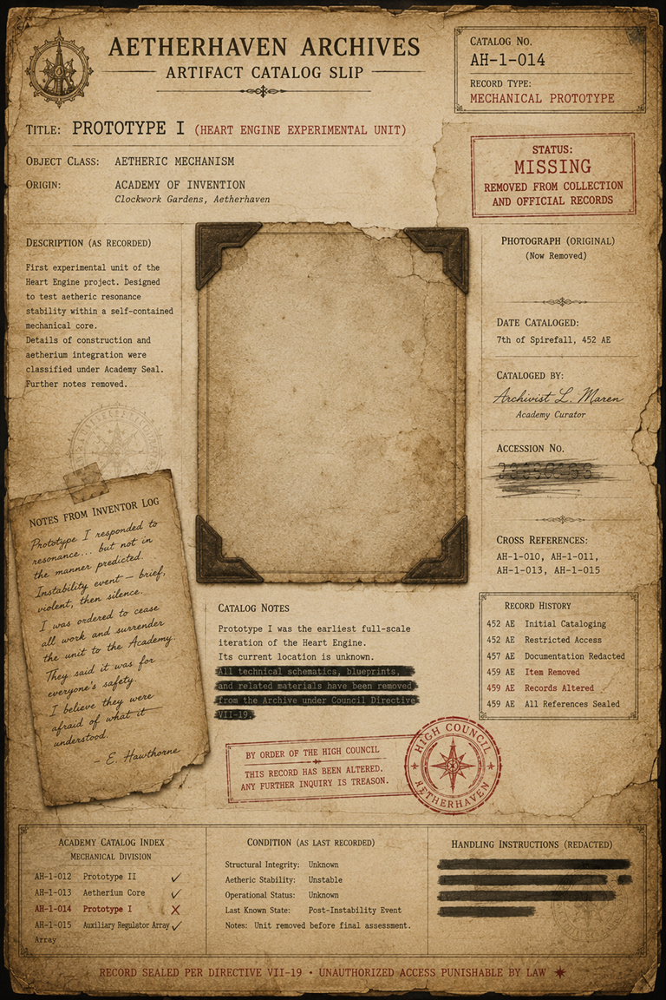

# The Missing Prototype I Catalog Card

> **Artifact Image Slate #12** · Amelia and the Aether Gauntlet · [Artifact standard](../CANON_MARKDOWN_STANDARD.md)

## Visual Reference

[Open full image](../art/AH-1-014_Prototype_I.png)

## Canonical Purpose

Confirms that Prototype I existed but has been removed from both the collection and official records.

## Intended Form

Torn Academy catalog slip, empty photograph mounting corners, and erased accession number.

## Related Canon

- [The Disappearance of Prototype I](../story_arcs/The_Disappearance_of_Prototype_I.md)
- [The Black Catalogue Arc](../story_arcs/The_Black_Catalogue_Arc.md)

## TODO

- [x] Link active canonical art.
- [ ] Confirm archive catalog number, recovery metadata, and publication-safe caption.
- [ ] Add backlinks from every profile that directly references this artifact.
- [ ] Reconcile this slate concept with newer canon before final publication.
