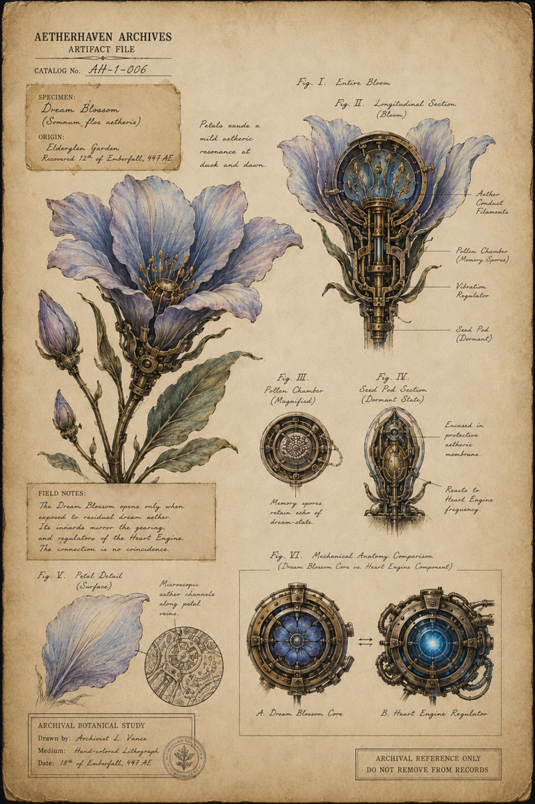

# Botanical Plate of the Dream Blossom

> **Artifact Image Slate #15** · [The Clockwork Gardens](../locations/The_Clockwork_Gardens.md) · [Artifact standard](../docs/standards/CANON_MARKDOWN_STANDARD.md)

## Visual Reference

[Open full image](../art/AH-1-006_Dream_Blossom.png)

## Plate Text Transcription — Visual Evidence Only

> This section records text that is physically visible in the active image. Illegible, abraded, redacted, or distorted text is labeled rather than reconstructed. Plate text is preserved even when it conflicts with newer canon.

### Archive heading and identification

- **AETHERHAVEN ARCHIVES**
- **ARTIFACT FILE**
- **CATALOG No.** `AH-1-006`

### Specimen card

- **SPECIMEN:** `Dream Blossom`
- Scientific name: `(Somnium flos aetheris)`
- **ORIGIN:** `Elderglen Garden`
- `Recovered 12th of Emberfall, 447 AE`

### General botanical note

> Petals exude a mild aetheric resonance at dusk and dawn.

### Figure labels

- **Fig. I. Entire Bloom**
- **Fig. II. Longitudinal Section (Bloom)**
- **Fig. III. Pollen Chamber (Magnified)**
- **Fig. IV. Seed Pod Section (Dormant State)**
- **Fig. V. Petal Detail (Surface)**
- **Fig. VI. Mechanical Anatomy Comparison (Dream Blossom Core vs. Heart Engine Component)**

### Longitudinal-section labels

- **Aether Conduit Filaments**
- **Pollen Chamber (Memory Spores)**
- **Vibration Regulator**
- **Seed Pod (Dormant)**

### Magnified pollen-chamber note

> Memory spores retain echo of dream-state.

### Dormant seed-pod notes

> Encased in protective aetheric membrane.

> Reacts to Heart Engine frequency.

### Field notes

> The Dream Blossom opens only when exposed to residual dream aether. Its innards mirror the gearing and regulators of the Heart Engine. The connection is no coincidence.

### Petal-detail note

> Microscopic aether channels along petal veins.

### Mechanical comparison labels

- **A. Dream Blossom Core**
- **B. Heart Engine Regulator**

A double-headed arrow between the two mechanisms indicates comparison or correspondence.

### Archival botanical-study block

- **ARCHIVAL BOTANICAL STUDY**
- **Drawn by:** `Archivist L. Vance`
- **Medium:** `Hand-colored lithograph`
- **Date:** `18th of Emberfall, 447 AE`

### Control notice

> **ARCHIVAL REFERENCE ONLY**  
> **DO NOT REMOVE FROM RECORDS**

## Complete Plate Description — Visual Evidence Only

The plate is a hand-colored botanical and mechanical study on lightly stained parchment. The primary specimen is a large pale-blue flower with lavender edges, fine veins, green leaves, and a brass-and-steel mechanism integrated into its stem and center.

Six figures document the organism:

1. **Entire bloom:** a flowering stem with one open blossom, several closed buds, leaves, and visible mechanical joints in the stalk.
2. **Longitudinal section:** half of the bloom is cut away to reveal pistons, conduits, a central chamber, filament-like blue structures, and a dormant seed mechanism.
3. **Pollen chamber:** a circular brass chamber containing a patterned inner membrane and linked chain or conduit.
4. **Dormant seed pod:** a narrow blue-and-brass pod with protective outer petals and a compact internal mechanism.
5. **Petal surface:** a single pale-blue petal beside a microscopic circular view of branching aether channels.
6. **Mechanical comparison:** the flower’s blue petaled core is compared directly with a glowing blue Heart Engine regulator in a more industrial housing.

The botanical color palette is blue, violet, green, brass, and dark steel. The mechanical parts are organically embedded rather than attached as obvious replacements. The archival study bears a small botanical seal near the artist information. No redactions, signatures beyond the named archivist, or security stamps are visible.

## Non-Visual Canon References and Story Context

The plate visually establishes that Dream Blossom anatomy resembles [Heart Engine](../locations/The_Aetherium.md) machinery. The exact biological, aetheric, or historical explanation belongs to [Juniper Bell](../characters/Juniper_Bell.md), [The Moon Garden](../locations/The_Moon_Garden.md), and [The Keeper of Dreams](../story_arcs/The_Keeper_of_Dreams.md).

The plate identifies the specimen’s origin as “Elderglen Garden.” Current canon describes [the Moon Garden](../locations/The_Moon_Garden.md) as a hidden nocturnal layer of [the Clockwork Gardens](../locations/The_Clockwork_Gardens.md). The relationship between Elderglen Garden, [the Moon Garden](../locations/The_Moon_Garden.md), and the visible [Clockwork Gardens](../locations/The_Clockwork_Gardens.md) is not resolved by this image.

The term “memory spores” is visible plate terminology. Their precise capabilities should not be expanded beyond linked canon.

## Related Canon

- [Juniper Bell](../characters/Juniper_Bell.md)
- [The Moon Garden](../locations/The_Moon_Garden.md)
- [The Keeper of Dreams](../story_arcs/The_Keeper_of_Dreams.md)

## Related Historical Events

- [The First Dream Bloom](../historical_events/The_First_Dream_Bloom.md)

## Continuity Notes

- This file is authoritative for the visible content and physical presentation of the active artifact image or images.
- Linked character, organization, location, and story-arc files remain authoritative for broader history and plot context.
- Visible plate claims are not silently corrected when they conflict with later canon; discrepancies are documented explicitly.
- Material from `unused/` is excluded and was not consulted.

## TODO / Production Checklist

- [x] Active canonical art linked.
- [x] All clearly readable plate text transcribed.
- [x] Dates, signatures, seals, stamps, redactions, names, places, and identifying marks documented.
- [x] Complete visual-only plate description added.
- [x] Non-visual canon and story context separated from visual evidence.
- [ ] Add backlinks from every active profile that directly references this artifact.
- [ ] Resolve documented plate/canon discrepancies only through an explicit canon decision.
- [ ] Approve a publication-safe caption.
