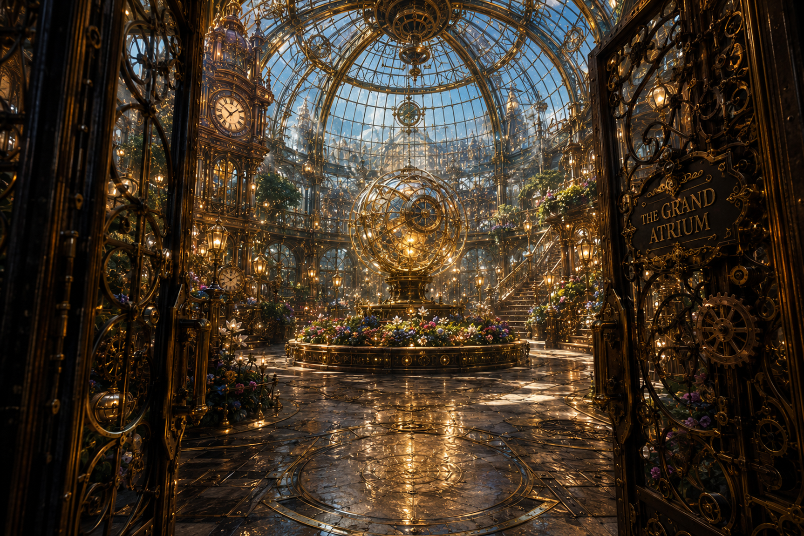

# The Grand Atrium Architectural Lithograph

> **Artifact Image Slate #17** · The Clockwork Gardens · [Artifact standard](../CANON_MARKDOWN_STANDARD.md)

## Visual Reference

[Open full image](../art/The_Grand_Atrium.png)

## Canonical Purpose

Shows the central orrery, hidden maintenance passages, and one sealed doorway omitted from public plans.

## Intended Form

Antique elevation and cutaway of the glass dome.

## Related Canon

- [Juniper Bell](../characters/Juniper_Bell.md)
- [Conservancy of Living Mechanisms](../organizations/The_Conservancy_of_Living_Mechanisms.md)
- [The Moon Garden](../locations/The_Moon_Garden.md)

## TODO

- [x] Link active canonical art.
- [ ] Confirm archive catalog number, recovery metadata, and publication-safe caption.
- [ ] Add backlinks from every profile that directly references this artifact.
- [ ] Reconcile this slate concept with newer canon before final publication.
