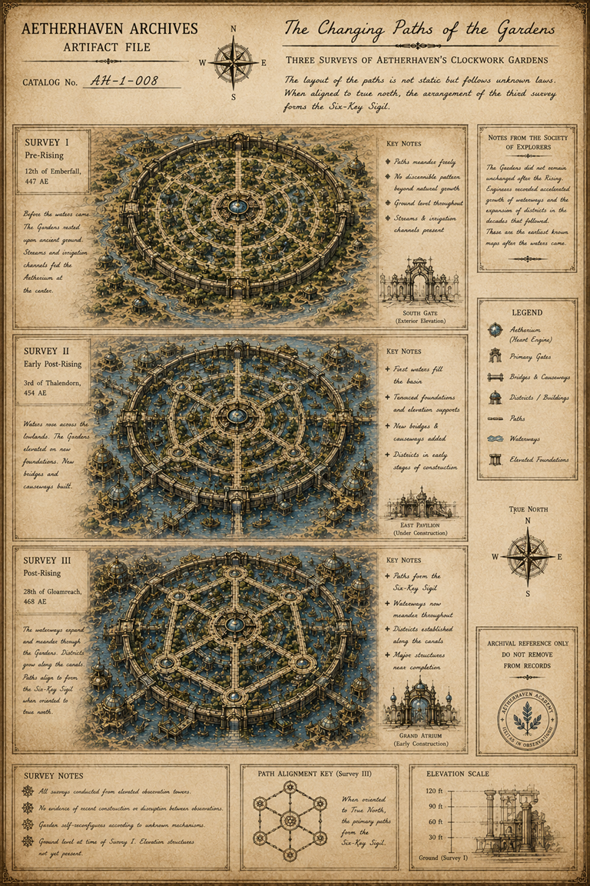
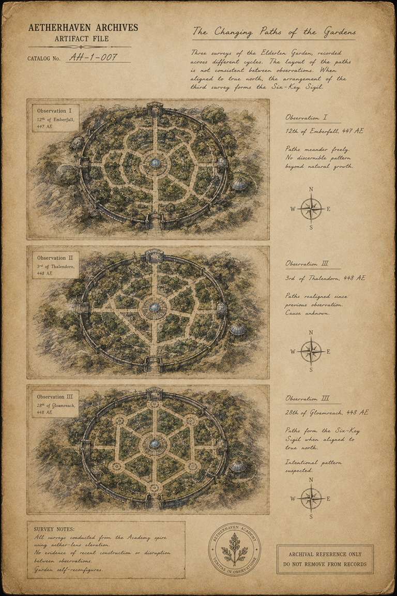

# The Changing Paths of the Gardens

> **Artifact Image Slate #18** · [The Clockwork Gardens](../locations/The_Clockwork_Gardens.md) · [Artifact standard](../docs/standards/CANON_MARKDOWN_STANDARD.md)

## Visual Reference

[Open full image](../art/AH-1-001_The_Changing_Paths_of_the_Gardens.png)

[Open full image](../art/AH-1-007_The_Changing_Paths_of_the_Gardens.png)

## Plate Text Transcription — Visual Evidence Only

> This section records text that is physically visible in the active image. Illegible, abraded, redacted, or distorted text is labeled rather than reconstructed. Plate text is preserved even when it conflicts with newer canon.

Two active plates document the changing paths. They contain overlapping but contradictory dates, catalog numbers, place names, and survey histories. Each plate is transcribed independently.

## Variant A — Three Surveys of [Aetherhaven](../locations/Aetherhaven.md)’s [Clockwork Gardens](../locations/The_Clockwork_Gardens.md)

### Archive heading and identification

- **[AETHERHAVEN ARCHIVES](../organizations/The_Aetherhaven_Archives.md)**
- **ARTIFACT FILE**
- **CATALOG No.** `AH-1-008`
- **The Changing Paths of the Gardens**
- **THREE SURVEYS OF AETHERHAVEN’S [CLOCKWORK GARDENS](../locations/The_Clockwork_Gardens.md)**

### Introductory statement

> The layout of the paths is not static but follows unknown laws. When aligned to true north, the arrangement of the third survey forms [the Six-Key Sigil](003_The_Six_Key_Sigil.md).

### Survey I

- **SURVEY I**
- **Pre-Rising**
- `12th of Emberfall, 447 AE`

> Before the waters came. The Gardens rested upon ancient ground. Streams and irrigation channels fed [the Aetherium](../locations/The_Aetherium.md) at the center.

**KEY NOTES**

- Paths meander freely
- No discernible pattern beyond natural growth
- Ground level throughout
- Streams & irrigation channels present

Caption: **SOUTH GATE (Exterior Elevation)**

### Survey II

- **SURVEY II**
- **Early Post-Rising**
- `3rd of Thalendorn, 454 AE`

> Waters rose across the lowlands. The Gardens elevated on new foundations. New bridges and causeways built.

**KEY NOTES**

- First waters fill the basin
- Terraced foundations and elevation supports
- New bridges & causeways added
- Districts in early stages of construction

Caption: **EAST PAVILION (Under Construction)**

### Survey III

- **SURVEY III**
- **Post-Rising**
- `28th of Gloamreach, 468 AE`

> The waterways expand and meander through the Gardens. Districts grow along the canals. Paths align to form [the Six-Key Sigil](003_The_Six_Key_Sigil.md) when oriented to true north.

**KEY NOTES**

- Paths form [the Six-Key Sigil](003_The_Six_Key_Sigil.md)
- Waterways now meander throughout
- Districts established along the canals
- Major structures near completion

Caption: **[GRAND ATRIUM](../locations/The_Grand_Atrium.md) (Early Construction)**

### [Society of Explorers](../organizations/The_Society_of_Explorers.md) note

- **NOTES FROM [THE SOCIETY OF EXPLORERS](../organizations/The_Society_of_Explorers.md)**

> The Gardens did not remain unchanged after the Rising. Engineers recorded accelerated growth of waterways and the expansion of districts in the decades that followed. These are the earliest known maps after the waters came.

### Legend

- **[Aetherium](../locations/The_Aetherium.md) ([Heart Engine](../locations/The_Aetherium.md))**
- **Primary Gates**
- **Bridges & Causeways**
- **Districts / Buildings**
- **Paths**
- **Waterways**
- **Elevated Foundations**

### Survey notes

- All surveys conducted from elevated observation towers.
- No evidence of recent construction or disruption between observations.
- Garden self-reconfigures according to unknown mechanism.
- Ground level at time of Survey I. Elevation structures not yet present.

### Alignment key

- **PATH ALIGNMENT KEY (Survey III)**

> When oriented to True North, the primary paths form [the Six-Key Sigil](003_The_Six_Key_Sigil.md).

### Elevation scale

- `120 ft`
- `90 ft`
- `60 ft`
- `Ground (Survey I)`

### Control and seal

- **TRUE NORTH** compass marked `N`, `E`, `S`, and `W`.
- **ARCHIVAL REFERENCE ONLY — DO NOT REMOVE FROM RECORDS**
- Circular **AETHERHAVEN ACADEMY** seal; lower motto reads **VERITAS IN OBSERVATIO**.

---

## Variant B — Three Surveys of the Elderglen Garden

### Archive heading and identification

- **[AETHERHAVEN ARCHIVES](../organizations/The_Aetherhaven_Archives.md)**
- **ARTIFACT FILE**
- **CATALOG No.** `AH-1-007`
- **The Changing Paths of the Gardens**

### Introductory statement

> Three surveys of the Elderglen Garden, recorded across different cycles. The layout of the paths is not consistent between observations. When aligned to true north, the arrangement of the third survey forms [the Six-Key Sigil](003_The_Six_Key_Sigil.md).

### Observation I

Map label:

- **Observation I**
- `12th of Emberfall, 447 AE`

Right-side note:

- **Observation I**
- `12th of Emberfall, 447 AE`

> Paths meander freely.  
> No discernible pattern beyond natural growth.

A compass is marked `N`, `E`, `S`, and `W`.

### Observation II

Map label:

- **Observation II**
- `3rd of Thalendorn, 448 AE`

Right-side note:

- **Observation II**
- `3rd of Thalendorn, 448 AE`

> Paths retained since previous observation.  
> Cause unknown.

A compass is marked `N`, `E`, `S`, and `W`.

### Observation III

Map label:

- **Observation III**
- `28th of Gloamreach, 448 AE`

Right-side note:

- **Observation III**
- `28th of Gloamreach, 448 AE`

> Paths form [the Six-Key Sigil](003_The_Six_Key_Sigil.md) when aligned to true north.

> Intentional pattern suspected.

A compass is marked `N`, `E`, `S`, and `W`.

### Survey notes

> All surveys conducted from [the Academy](../organizations/The_Academy_of_Invention.md) spire using aether-lens elevation.
> No evidence of recent construction or disruption between observations.  
> Garden self-reconfigures.

### Control and seal

- Circular **AETHERHAVEN ACADEMY** botanical seal; motto reads **VERITAS IN OBSERVATIO**.
- **ARCHIVAL REFERENCE ONLY — DO NOT REMOVE FROM RECORDS**

## Complete Plate Description — Visual Evidence Only

### Variant A visual description

Variant A is a detailed three-stage historical map plate. Each survey is presented as a colored isometric plan of the same circular garden complex. The central Aetherium is shown as a blue-lit circular structure. Four primary gates align to the cardinal directions.

- **Survey I** shows a green, ground-level garden surrounded by streams and undeveloped land. Paths meander irregularly.
- **Survey II** shows the garden raised above expanding blue water, with new bridges, piers, foundations, and early surrounding buildings.
- **Survey III** shows a more developed canal district. Six circular path nodes and connecting paths form a hexagonal/sixfold arrangement around the center.

The right column contains a Society note, a pictorial legend, a true-north compass, archive notice, and Academy seal. Small architectural elevations depict the South Gate, East Pavilion, Grand Atrium, and an elevation scale.

### Variant B visual description

Variant B is a simpler scientific survey sheet. Three top-down sepia-and-green drawings show the same walled circular garden from an elevated viewpoint. The central blue Aetherium, four gates, outer wall, and one domed structure at right remain stable while the internal paths change.

- Observation I contains irregular radial and looping paths.
- Observation II contains a more segmented set of branching paths.
- Observation III forms a precise six-node network matching the Six-Key geometry.

Each drawing has its own date label and a matching compass in the right margin. The page uses less color and contains no waterways, district development, or architectural elevations.

### Visible contradictions preserved between variants

- Catalog numbers differ: `AH-1-008` and `AH-1-007`.
- Variant A names Aetherhaven’s Clockwork Gardens; Variant B names Elderglen Garden.
- Variant A spans `447 AE` to `468 AE`; Variant B places all observations in `447–448 AE`.
- Variant A documents the Rising, waterways, elevated foundations, bridges, and district growth; Variant B documents rapid path changes without visible construction.
- Both conclude that the third arrangement forms the Six-Key Sigil when aligned to true north.

No redactions, signatures, or confidentiality stamps are visible on either plate.

## Non-Visual Canon References and Story Context

Current canon treats [the Clockwork Gardens](../locations/The_Clockwork_Gardens.md) as living, self-reconfiguring, and capable of hidden layers, including [The Moon Garden](../locations/The_Moon_Garden.md). [Juniper Bell](../characters/Juniper_Bell.md) can work with the Gardens to reveal or limit access but does not command them.

The two active plates are preserved as variant records rather than reconciled history. Their date systems, use of “Elderglen Garden,” and descriptions of the Rising may represent different surveys, competing archives, earlier art iterations, or chronology changes. No single explanation is selected here.

The geometric relationship to [The Six-Key Sigil](003_The_Six_Key_Sigil.md) is visible in both images and is the stable shared evidence.

## Related Canon

- [Juniper Bell](../characters/Juniper_Bell.md)
- [Conservancy of Living Mechanisms](../organizations/The_Conservancy_of_Living_Mechanisms.md)
- [The Moon Garden](../locations/The_Moon_Garden.md)

## Related Historical Events

- [The Rising](../historical_events/The_Rising.md)
- [The Great Garden Rearrangement](../historical_events/The_Great_Garden_Rearrangement.md)

## Continuity Notes

- This file is authoritative for the visible content and physical presentation of the active artifact image or images.
- Linked character, organization, location, and story-arc files remain authoritative for broader history and plot context.
- Visible plate claims are not silently corrected when they conflict with later canon; discrepancies are documented explicitly.
- Material from `unused/` is excluded and was not consulted.

## TODO / Production Checklist

- [x] Active canonical art linked.
- [x] All clearly readable plate text transcribed.
- [x] Dates, signatures, seals, stamps, redactions, names, places, and identifying marks documented.
- [x] Complete visual-only plate description added.
- [x] Non-visual canon and story context separated from visual evidence.
- [ ] Add backlinks from every active profile that directly references this artifact.
- [ ] Resolve documented plate/canon discrepancies only through an explicit canon decision.
- [ ] Approve a publication-safe caption.
