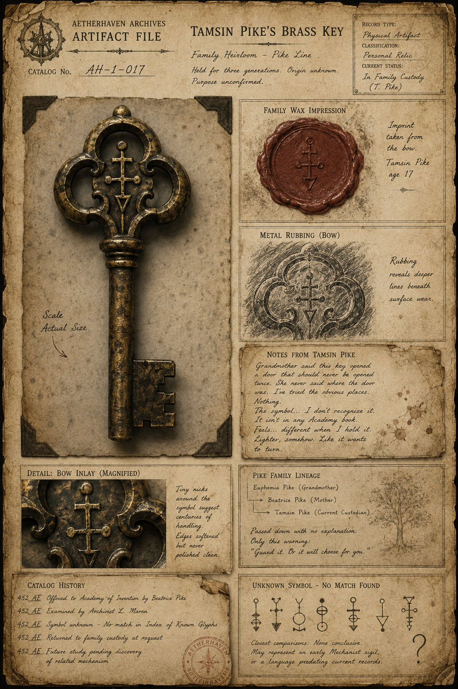

# Tamsin Pike’s Brass Key

> **Artifact Image Slate #21** · The Thirteenth Canal · [Artifact standard](../CANON_MARKDOWN_STANDARD.md)

## Visual Reference

[Open full image](../art/AH-1-017_Tamsin_Pike's_Brass_Key.png)

## Plate Text Transcription — Visual Evidence Only

> This section records text that is physically visible in the active image. Illegible, abraded, redacted, or distorted text is labeled rather than reconstructed. Plate text is preserved even when it conflicts with newer canon.

### Archive heading and identification

- **AETHERHAVEN ARCHIVES**
- **ARTIFACT FILE**
- **CATALOG No.** `AH-1-017`
- **TAMSIN PIKE’S BRASS KEY**

### Family identification

- **Family Heirloom — Pike Line**
- `Held for three generations. Origin unknown.`
- `Purpose unconfirmed.`

### Record block

- **RECORD TYPE:** `Physical Artifact`
- **CLASSIFICATION:** `Personal Relic`
- **CURRENT STATUS:** `In Family Custody (T. Pike)`

### Scale note

> Scale  
> Actual Size

### Family wax impression

- **FAMILY WAX IMPRESSION**

> Imprint taken from the bow.  
> Tamsin Pike  
> age 17

### Metal rubbing

- **METAL RUBBING (BOW)**

> Rubbing reveals deeper lines beneath surface wear.

### Notes from Tamsin Pike

> Grandmother said this key opened a door that should never be opened twice. She never said where the door was. I’ve tried the obvious places. Nothing.

> The symbol… I don’t recognize it.  
> It isn’t in any Academy book.  
> Feels… different when I hold it.  
> Lighter, somehow. Like it wants to turn.

### Magnified bow detail

- **DETAIL: BOW INLAY (MAGNIFIED)**

> Tiny nicks around the symbol suggest centuries of handling.  
> Edges softened but never polished clean.

### Pike family lineage

- **PIKE FAMILY LINEAGE**
- `Euphemia Pike (Grandmother)`
- `→ Beatrice Pike (Mother)`
- `→ Tamsin Pike (Current Custodian)`

> Passed down with no explanation.  
> Only this warning:  
> “Guard it. Or it will choose for you.”

### Catalog history

- `452 AE` — Offered to Academy of Invention by Beatrice Pike
- `452 AE` — Examined by Archivist L. Maren
- `452 AE` — Symbol unknown — No match in Index of Known Glyphs
- `452 AE` — Returned to family custody at request
- `452 AE` — Future study pending discovery of related mechanism

### Unknown-symbol comparison

- **UNKNOWN SYMBOL — NO MATCH FOUND**

> Closest comparisons: None conclusive.  
> May represent an early Mechanist sigil, or a language predating current records.

The comparison row shows seven different line-and-circle glyphs and a large question mark. None is identified by name.

### Seal

A circular institutional stamp overlaps the catalog-history panel. The central compass-star is clear, but the small outer wording is only partly legible and is not transcribed as a confirmed phrase.

## Complete Plate Description — Visual Evidence Only

The principal object is a long, darkened brass key displayed at actual size in a corner-mounted archival frame. The key has a heavy cylindrical shaft and a broad rectangular bit with stepped notches. Its bow is an ornate three-lobed openwork shape resembling a trefoil.

A distinctive inlaid symbol occupies the center of the bow. It consists of a vertical line with:

- a small loop or circle at the top;
- two short horizontal bars crossing the shaft;
- small circular terminals on the longer crossbar;
- a downward-pointing arrowhead at the bottom.

The key’s surface is deeply worn, pitted, scratched, and darkened by age. Raised edges remain warm brass where repeated handling has polished them.

Supporting evidence includes:

1. a red-brown wax impression taken from the bow symbol;
2. a charcoal rubbing showing deeper lines beneath the visible wear;
3. a magnified photograph of the bow inlay;
4. a handwritten family-history panel;
5. a catalog-history panel with an institutional stamp;
6. a comparison chart of unrelated glyphs.

A faint botanical branch sketch appears behind the family lineage. The parchment has torn edges, stains, pinned corners, and tape. No redactions or signatures are present. The visual emphasis is on inherited handling and the symbol’s failure to match known records.

## Non-Visual Canon References and Story Context

The key’s relationship to [Tamsin Pike](../characters/Tamsin_Pike.md), the [Underclock](../organizations/The_Underclock.md), and [The Disappearance of Prototype I](../story_arcs/The_Disappearance_of_Prototype_I.md) remains broader story canon rather than directly visible proof.

The plate states that [Tamsin](../characters/Tamsin_Pike.md) is seventeen and identifies Euphemia and [Beatrice](../characters/Chief_Inspector_Beatrice_Thorne.md) Pike. Those names and ages are plate evidence and should be treated as current working details unless deliberately revised.

The key is not a universal [Underclock](../organizations/The_Underclock.md) emblem or master key. Its exact door, inherited obligation, and possible role in a sanctuary route remain unresolved.

## Related Canon

- [Tamsin Pike](../characters/Tamsin_Pike.md)
- [The Underclock](../organizations/The_Underclock.md)
- [The Disappearance of Prototype I](../story_arcs/The_Disappearance_of_Prototype_I.md)

## Continuity Notes

- This file is authoritative for the visible content and physical presentation of the active artifact image or images.
- Linked character, organization, location, and story-arc files remain authoritative for broader history and plot context.
- Visible plate claims are not silently corrected when they conflict with later canon; discrepancies are documented explicitly.
- Material from `unused/` is excluded and was not consulted.

## TODO / Production Checklist

- [x] Active canonical art linked.
- [x] All clearly readable plate text transcribed.
- [x] Dates, signatures, seals, stamps, redactions, names, places, and identifying marks documented.
- [x] Complete visual-only plate description added.
- [x] Non-visual canon and story context separated from visual evidence.
- [ ] Add backlinks from every active profile that directly references this artifact.
- [ ] Resolve documented plate/canon discrepancies only through an explicit canon decision.
- [ ] Approve a publication-safe caption.
