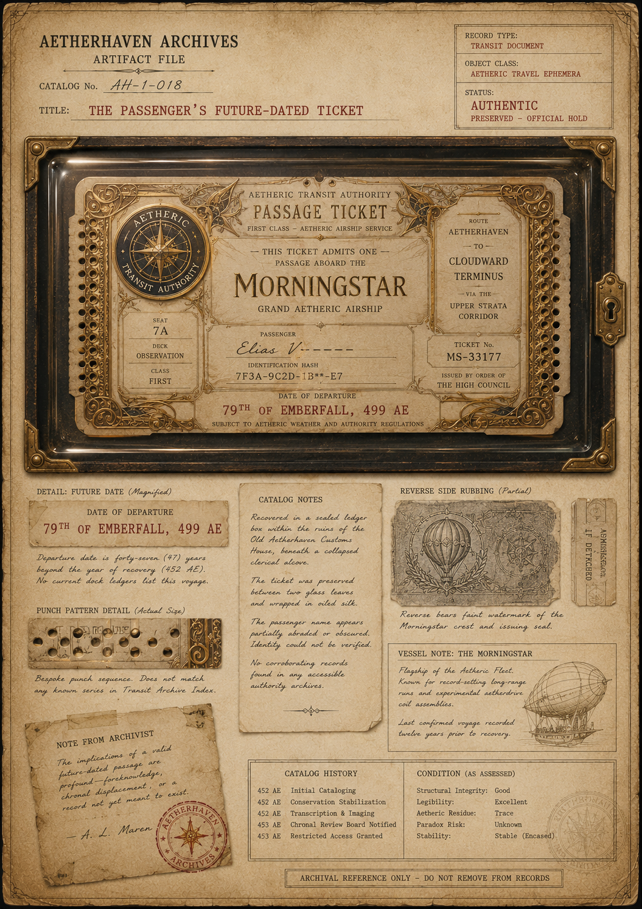

# The Passenger’s Future-Dated Ticket

> **Artifact Image Slate #25** · The Passenger of Dock Zero · [Artifact standard](../CANON_MARKDOWN_STANDARD.md)

## Visual Reference

[Open full image](../art/AH-1-018_The_Passenger's_Future-Date_Ticket.png)

## Plate Text Transcription — Visual Evidence Only

> This section records text that is physically visible in the active image. Illegible, abraded, redacted, or distorted text is labeled rather than reconstructed. Plate text is preserved even when it conflicts with newer canon.

### Archive heading and identification

- **AETHERHAVEN ARCHIVES**
- **ARTIFACT FILE**
- **CATALOG No.** `AH-1-018`
- **TITLE:** `THE PASSENGER’S FUTURE-DATED TICKET`

### Record block

- **RECORD TYPE:** `TRANSIT DOCUMENT`
- **OBJECT CLASS:** `AETHERIC TRAVEL EPHEMERA`
- **STATUS:** `AUTHENTIC`
- `PRESERVED — OFFICIAL HOLD`

### Passage-ticket heading

- **AETHERIC TRANSIT AUTHORITY**
- **PASSAGE TICKET**
- **FIRST CLASS — AETHERIC AIRSHIP SERVICE**
- **THIS TICKET ADMITS ONE**
- **PASSAGE ABOARD THE**
- **MORNINGSTAR**
- **GRAND AETHERIC AIRSHIP**

### Transit seal

The circular seal on the ticket reads:

- **AETHERIC**
- **TRANSIT AUTHORITY**

A compass-like star fills the center.

### Seat and class fields

- **SEAT:** `7A`
- **DECK:** `OBSERVATION`
- **CLASS:** `FIRST`

### Passenger and identification fields

- **PASSENGER:** the visible handwriting appears to begin `Elias V...`; the remainder is replaced by dashes or is abraded. The plate does not provide a complete verifiable name.
- **IDENTIFICATION HASH:** `7F3A-9C2D-1B**-E7`

### Route and authority fields

- **ROUTE:** `AETHERHAVEN`
- **TO:** `CLOUDWARD TERMINUS`
- **VIA THE:** `UPPER STRATA CORRIDOR`
- **TICKET No.:** `MS-33177`
- **ISSUED BY ORDER OF THE HIGH COUNCIL**

### Departure date

- **DATE OF DEPARTURE:** `79TH OF EMBERFALL, 499 AE`
- Footer: **SUBJECT TO AETHERIC WEATHER AND AUTHORITY REGULATIONS**

### Detachable stub

A separate vertical stub is shown beside the case. The lower line clearly reads:

- **IF DETACHED**

The upper word is distorted or partially illegible; it appears to begin with `ADMIT...` but is not confidently transcribed.

### Future-date detail

- **DETAIL: FUTURE DATE (Magnified)**
- **DATE OF DEPARTURE:** `79TH OF EMBERFALL, 499 AE`

> Departure date is forty-seven (47) years beyond the year of recovery (452 AE). No current dock ledgers list this voyage.

### Punch-pattern detail

- **PUNCH PATTERN DETAIL (Actual Size)**

> Bespoke punch sequence. Does not match any known series in Transit Archive Index.

### Catalog notes

> Recovered in a sealed ledger box within the ruins of the Old Aetherhaven Customs House, beneath a collapsed clerical alcove.

> The ticket was preserved between two glass leaves and wrapped in oiled silk.

> The passenger name appears partially abraded or obscured. Identity could not be verified.

> No corroborating records found in any accessible authority archives.

### Reverse-side rubbing

- **REVERSE SIDE RUBBING (Partial)**

> Reverse bears faint watermark of the Morningstar crest and issuing seal.

### Vessel note

- **VESSEL NOTE: THE MORNINGSTAR**

> Flagship of the Aetheric Fleet.  
> Known for record-setting long-range runs and experimental aetherdrive coil assemblies.

> Last confirmed voyage recorded twelve years prior to recovery.

### Note from archivist

> The implications of a valid future-dated passage are profound — foreknowledge, chronal displacement, or a record not yet meant to exist.  
> — A. L. Maren

A red circular **AETHERHAVEN ARCHIVES** stamp overlaps the note.

### Catalog history

- `452 AE` — Initial Cataloging
- `452 AE` — Conservation Stabilization
- `452 AE` — Transcription & Imaging
- `453 AE` — Chronal Review Board Notified
- `453 AE` — Restricted Access Granted

### Condition as assessed

- **Structural Integrity:** `Good`
- **Legibility:** `Excellent`
- **Aetheric Residue:** `Trace`
- **Paradox Risk:** `Unknown`
- **Stability:** `Stable (Encased)`

### Final control notice

> **ARCHIVAL REFERENCE ONLY — DO NOT REMOVE FROM RECORDS**

## Complete Plate Description — Visual Evidence Only

The ticket is preserved horizontally beneath glass in a black archival display case with ornate brass corners and a keyhole latch on the right. The paper ticket has clipped corners, punched side strips, extensive gold filigree, and a formal cream-and-brass design.

The central title **MORNINGSTAR** is the largest text. A circular Aetheric Transit Authority seal occupies the left side. Route, seat, passenger, hash, ticket number, issuing authority, and departure date are divided into bordered fields. The future date is printed in dark red along the lower center.

The dossier below the case contains:

1. a magnified strip of the future date;
2. an actual-size sample of the punched edge;
3. a catalog-note sheet;
4. a partial rubbing of the reverse, showing a balloon or airship crest and circular seal;
5. a separate detachable stub;
6. a vessel note with a line drawing of a rigid airship;
7. an archivist’s note and stamp;
8. catalog history and condition tables.

The ticket’s passenger field is visibly incomplete. The writing appears to begin with `Elias V`, but the remaining characters are not present or are obscured. This visual fragment cannot establish the passenger’s identity.

The plate has no black redactions. Its uncertainty is conveyed through abrasion, incomplete passenger text, an unidentified punch sequence, trace residue, and a declared unknown paradox risk.

## Non-Visual Canon References and Story Context

Current canon identifies this as the future-dated ticket associated with [The Passenger of Dock Zero](../characters/The_Passenger_of_Dock_Zero.md), impounded by [Captain Mara Voss](../characters/Captain_Mara_Voss.md), and connected to the *Morningstar*, [The Aerial Docks](../locations/The_Aerial_Docks.md), and the [Gardens Airship Landing](../locations/The_Gardens_Airship_Landing.md).

The visible passenger fragment must **not** be treated as proof that the ticket belongs to Elias Hawthorne. Current canon keeps the passenger name damaged, blurred, and unverified. The apparent `Elias V...` text is recorded here only because it is physically visible in the generated image.

The plate’s recovery story at the Old Aetherhaven Customs House differs from the current story premise that Mara confiscated the ticket from the Passenger. The plate metadata may describe an earlier concept, a prior archival recovery, or an inconsistent record. The active character and location canon controls the story history until this discrepancy is explicitly reconciled.

## Related Canon

- [The Passenger of Dock Zero](../characters/The_Passenger_of_Dock_Zero.md)
- [Captain Mara Voss](../characters/Captain_Mara_Voss.md)
- [The Aerial Docks](../locations/The_Aerial_Docks.md)
- [Gardens Airship Landing](../locations/The_Gardens_Airship_Landing.md)

## Continuity Notes

- This file is authoritative for the visible content and physical presentation of the active artifact image or images.
- Linked character, organization, location, and story-arc files remain authoritative for broader history and plot context.
- Visible plate claims are not silently corrected when they conflict with later canon; discrepancies are documented explicitly.
- Material from `unused/` is excluded and was not consulted.

## TODO / Production Checklist

- [x] Active canonical art linked.
- [x] All clearly readable plate text transcribed.
- [x] Dates, signatures, seals, stamps, redactions, names, places, and identifying marks documented.
- [x] Complete visual-only plate description added.
- [x] Non-visual canon and story context separated from visual evidence.
- [ ] Add backlinks from every active profile that directly references this artifact.
- [ ] Resolve documented plate/canon discrepancies only through an explicit canon decision.
- [ ] Approve a publication-safe caption.
