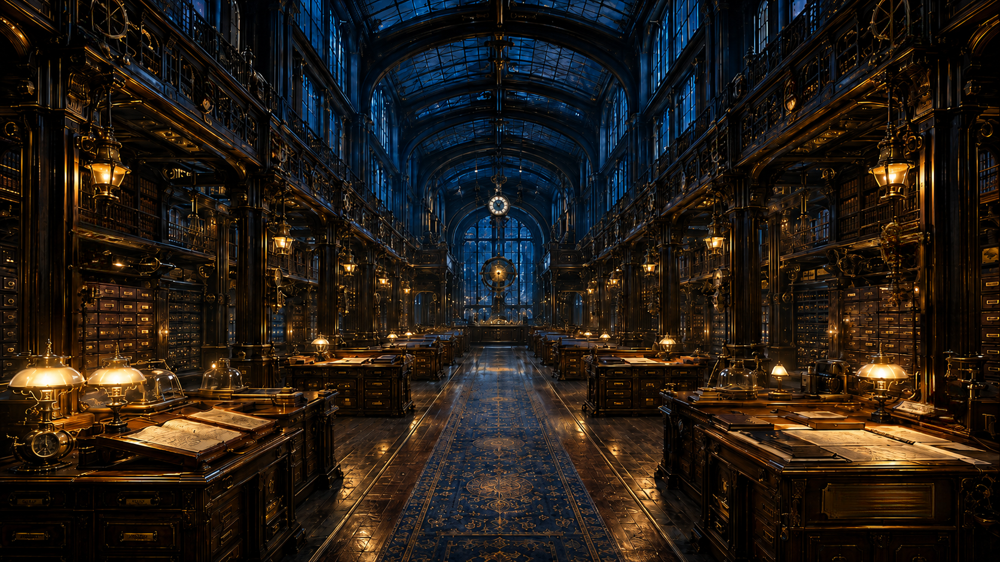

# The Great Archive Hall

## Map Reference

The Great Archive Hall is an **unlisted interior civic location within [the Government District](The_Government_District.md), map location #11**. It is not separately numbered on the city map.

## Visual Reference

`AA-2.png` is the active visual reference for the Great Archive Hall.

The image establishes the Hall's monumental central aisle, glazed roof, reading desks, catalog architecture, layered galleries, prominent timekeeping elements, expensive wood and metalwork, and its characteristic balance of warm amber light with cooler aether-blue atmosphere.

The reference image is staged without visitors so the architecture remains clear; this does **not** imply that the functioning public Hall is normally empty.

## Public Map Reference

The **Great Archive Hall** is the most recognizable public home of [the Aetherhaven Archives](../organizations/The_Aetherhaven_Archives.md), standing prominently within [the Government District](The_Government_District.md). Beneath its soaring glass roof, citizens, students, scholars, and curious visitors can consult public records, maps, histories, reference collections, and approved archival material from across Aetherhaven.

Warm amber lamps glow against dark wood, brass, iron, and glass, while clocks and precision mechanisms quietly track the city's famously complicated relationship with time. The Hall is both a working public library and a civic symbol: a place built to celebrate the belief that knowledge should be preserved, studied, and passed forward.

For many inquiries, however, the Great Hall provides only the first answer: **where the researcher must go next.**

## Canonical Summary

The **Great Archive Hall** is the principal public-facing location of [the Aetherhaven Archives](../organizations/The_Aetherhaven_Archives.md) and the place most citizens mean when they casually refer to “the Archives.”

Located in [the Government District](The_Government_District.md), the Hall is an **Open Archive** and functions much like Aetherhaven's great civic library, public research center, and symbolic repository of recorded history.

It provides public access to records, scholarship, maps, histories, reference material, approved artifacts and reproductions, and other knowledge cleared for general civic use.

The Hall does **not** contain the entirety of the Aetherhaven Archives.

The wider Archives are distributed across the city in specialist collections, workshops, museums, vaults, warehouses, offices, institutions, and other repositories. A Great Hall catalogue entry may therefore identify material that must be consulted elsewhere.

The Great Archive Hall presents the **public record**: what [the High Council](../organizations/The_High_Council_of_Aetherhaven.md), through the Aetherhaven Archives, has determined may be made available for general access.

That public record is curated but is not inherently propaganda. Most material is legitimate scholarship and preserved civic knowledge. At the same time, records may be incomplete, redacted, restricted, superseded, intentionally altered, or inconsistent with surviving evidence.

Aetherhaven's unstable chronology creates an additional complication: authentic records may sometimes disagree with one another without a human archivist having deliberately falsified either account.

## Civic, Social, and Narrative Role

The Great Archive Hall serves several overlapping roles in Aetherhaven.

### Public Library and Research Center

The Hall is open to ordinary citizens and provides a place to read, study, investigate family and civic history, consult maps, review public records, and begin more specialized research.

Students, inventors, historians, explorers, engineers, officials, and curious citizens may all use its Open Archive collections.

### Public Face of the Aetherhaven Archives

The Hall gives a physical and symbolic identity to an organization that is otherwise spread across the entire city.

Its architecture, catalog systems, reading spaces, exhibits, and public records represent Aetherhaven's commitment to preserving knowledge even when the underlying institution extends far beyond the building.

### Civic Memory

The Hall is one of the primary places where Aetherhaven presents its own history to its citizens.

The histories visible there are the histories recognized for public access. Material absent from the Hall is not automatically false, forbidden, or sinister; it may instead belong to a Scholarly Archive, Restricted Archive, another institution, a private collection, or a physical repository elsewhere in the city.

### Starting Point for Distributed Research

The Great Archive Hall is frequently where serious research begins rather than where it ends.

A public catalogue or archivist may direct a researcher toward:

- [the Academy of Invention](../organizations/The_Academy_of_Invention.md),
- a private professor or specialist,
- [the Great Workshops](The_Great_Workshops.md),
- a museum or specialist collection,
- another civic repository,
- a Restricted Archive viewing chamber,
- or the current custodian of a physical artifact.

The resulting movement between districts, institutions, people, and collections is a normal feature of archival research in Aetherhaven.

## Architecture and Atmosphere

The Great Archive Hall reflects the wealth, civic confidence, and formality of the Government District.

Its established visual language combines:

- monumental Victorian-influenced civic architecture,
- expensive dark wood,
- brass,
- iron and other metals,
- large glazed roof structures and windows,
- galleries and elevated architectural layers,
- functional clocks and timekeeping devices,
- gears, pipework, catalog mechanisms, and other archival machinery,
- reading desks and research furniture,
- warm amber illumination,
- and cooler aether-blue atmospheric light.

Mechanical systems are present to support the Archive's work rather than to turn the room into a factory. Machinery, clocks, catalog systems, and automated infrastructure should reinforce the Hall's primary identity as a place for research, reading, preservation, and discovery.

The lighting is warm enough for study without making the Hall feel brightly or uniformly illuminated. At night, the contrast between amber interior lamps, cooler aetheric light, and the darkness beyond the windows gives the Great Hall its characteristic atmosphere.

Timekeeping elements should remain visually prominent because the Archives exist in a city where dates, clocks, records, and chronology cannot always be taken for granted.

## Public Record and Curation

The Great Archive Hall makes available what the High Council has authorized for general civic access through the Aetherhaven Archives.

That distinction must be preserved carefully.

The Hall is **not** a propaganda chamber whose shelves are assumed to be false.

It is a genuine research institution containing substantial amounts of accurate and useful information.

However:

- not every Archive holding is Open,
- not every record is physically stored in the Hall,
- sensitive or dangerous material may be classified elsewhere,
- some public records may have been deliberately altered,
- and temporal disturbances may create authentic contradictions between records and evidence.

A researcher must therefore distinguish between **what the Great Hall says**, **what the wider Archives contain**, and **what surviving evidence ultimately supports**.

## Relationship to Archive Access Classes

The Great Archive Hall belongs primarily to the **Open Archives**.

It may contain catalogs or references pointing toward other access classes maintained by [the Aetherhaven Archives](../organizations/The_Aetherhaven_Archives.md), but general admission to the Hall does not grant access to those holdings.

### Scholarly Archives

A Great Hall record may identify a specialist collection whose use requires appropriate knowledge, experience, and legitimate need to know.

### Restricted Archives

A researcher may learn that a requested record or artifact exists but must be viewed under restricted authorization elsewhere, including controlled private viewing chambers in secure Government District buildings.

### Hidden Archives

The Hall does not provide ordinary public access to Hidden Archive holdings. Information about their existence, location, or contents may itself be protected.

### Lost Archives

A Hall catalog may preserve evidence that a missing record or artifact once existed even when no current repository can locate it. Such material belongs conceptually to the Lost Archives until found or otherwise resolved.

## Relationships

### [The Aetherhaven Archives](../organizations/The_Aetherhaven_Archives.md)

The Great Archive Hall is the Archives' flagship public location and symbolic civic face.

The Archives are an organization and distributed knowledge network; the Great Archive Hall is one physical component of that network.

### [The High Council of Aetherhaven](../organizations/The_High_Council_of_Aetherhaven.md)

The High Council governs the Aetherhaven Archives and therefore holds ultimate civic authority over the Great Archive Hall and the public record made available there.

### [The Government District](The_Government_District.md)

The Great Archive Hall is located within the Government District alongside the civic institutions that administer Aetherhaven.

The district also contains restricted archival buildings and controlled viewing facilities that are separate from the publicly accessible Great Hall.

### [Chancellor Octavia Vale](../characters/Chancellor_Octavia_Vale.md)

As Chancellor and First Voice of the High Council, Octavia Vale is part of the governing authority above the Archives. The Archive's operational leadership and the Chancellor's day-to-day relationship with the Great Hall remain to be developed.

## Visual Continuity

- Use `art/locations/aetherhaven_archive/AA-2.png` as the active location reference.
- Preserve the monumental central sightline and sense of a long civic research hall.
- Preserve the glazed roof and large windows.
- Preserve rich wood, brass, iron, glass, and functional mechanical detailing.
- Preserve prominent clocks and timekeeping mechanisms.
- Preserve the warm amber / cool aether-blue lighting relationship.
- The room should feel ornate and wealthy because of its Government District setting, but still practical as a functioning research institution.
- Machinery should support reading, cataloguing, preservation, movement, or archival operations rather than become unrelated decorative spectacle.
- The empty reference image is an architectural study, not evidence that the Hall lacks staff, researchers, or visitors during normal operation.

## Continuity Notes

- This file owns the **Great Archive Hall as a physical location**.
- [The Aetherhaven Archives](../organizations/The_Aetherhaven_Archives.md) owns the larger distributed organization, its access classes, and its citywide archival role.
- Do not use “Great Archive Hall” and “Aetherhaven Archives” as interchangeable terms.
- The Great Hall is an **Open Archive**.
- The Great Hall contains curated public records, but curated does not mean automatically propagandistic or false.
- Restricted archival buildings and private viewing chambers in the Government District are separate from the public Great Hall.
- Detailed named rooms, desks, departments, curator offices, staff hierarchy, request procedures, and internal bureaucratic routing have not yet been canonically defined.
- Future expansion should preserve the Archive's distributed-research model rather than making every inquiry solvable inside this one building.

## Development Checklist

- [x] Canonical summary approved.
- [x] Government District placement established.
- [x] Open Archive access status established.
- [x] Active canonical location image linked.
- [x] Relationship to the Aetherhaven Archives established.
- [x] Public-record curation principle established.
- [x] Distributed-research role established.
- [ ] Named internal spaces developed.
- [ ] Great Hall personnel and archivist roles developed.
- [ ] Research-request intake and routing process developed.
- [ ] Backlinks added from directly related profiles.

## Open Canon Questions

1. Who manages the Great Archive Hall on a daily basis?
2. Which archivist roles work directly with the public, and which specialists operate behind the public floor?
3. What named rooms, catalog systems, reading areas, exhibit spaces, and service points exist inside the Hall?
4. How does a public request become a referral to a Scholarly or Restricted Archive?
5. How are contradictory records flagged, preserved, and presented to researchers?
6. Which parts of the Great Hall's internal machinery are ordinary modern systems, and which may predate the institution?
